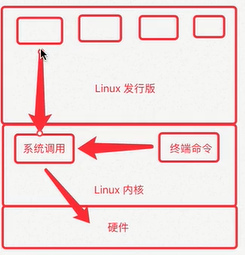
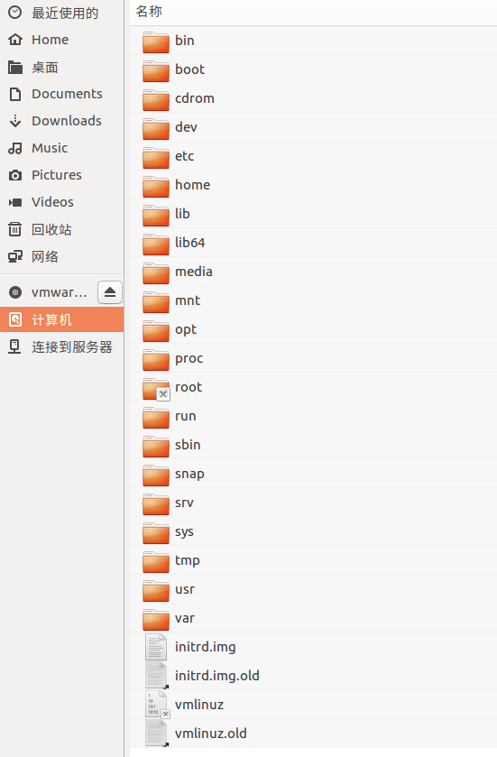
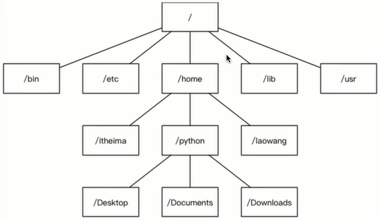
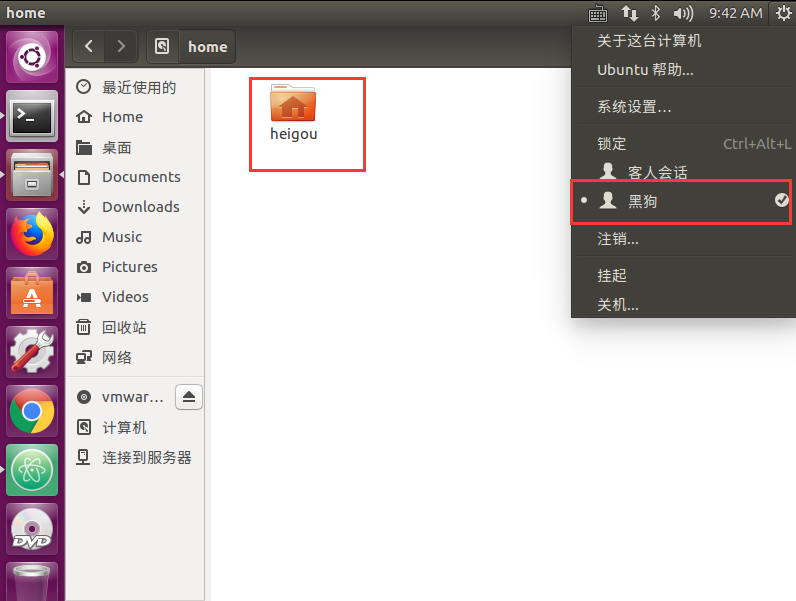

# Linux系统基础内容

## Linux内核及发行版
### Linux 内核版本

（1）内核（kernel）是系统的心脏，是运行程序和管理像磁盘和打印机等硬件设备的核心程序，它提供了一个在设备与应用程序间的抽象层

（2）Linux内核版本又分为稳定版和开发版，两种版本相互关联，相互循环

### Linux发行版本

（1）Linux发行版通常包含了包括桌面环境、媒体播放器、数据库等应用软件
常见发行版：Ubuntu、Redhat、Fedora、openSUSE、Linux Mint、Debian、Manjaro、Majeia、CentOS、Arch

（2）十大Linux服务器发行版排行（http://os.51cto.com/art/201612/526126.htm）

## Linux操作系统的文件和目录结构
### 单用户操作系统和多用户操作系统
（1）单用户操作系统：指一台计算机在同一时间只能由
**一个用户** 使用，一个用户独自享用系统的全部硬件和软件资源

**WindowsXP之前的版本都是单用户操作系统**

（2）多用户操作系统：指一台计算机在同一时间可以由
**多个用户** 使用，多个用户共享系统的全部硬件和软件资源

**Unix和Linux的设计初衷就是多用户操作系统**
### Windows和Linux文件系统区别
**Windows下的文件系统**

图形界面展示：

结构：

**Linux下的文件系统**

图形界面展示：

结构：

**Linux没有盘符的概念，只有一个根目录所有文件都在它下面**

### Ubuntu系统目录结构演示和简介

**系统目录基本了解**

**Linux主要目录速查表**

**computer下的文件都属于系统文件，个人只在home下操作**

### Ubuntu图形界面基本使用

**略**
