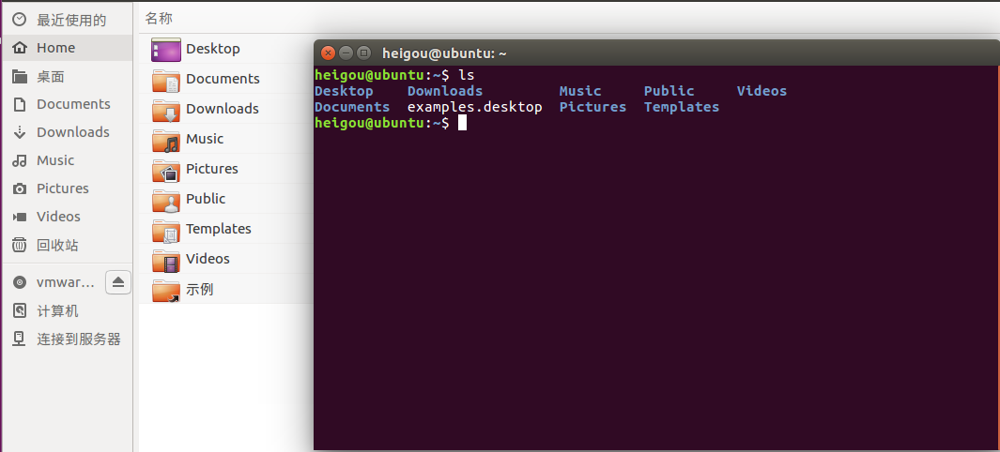
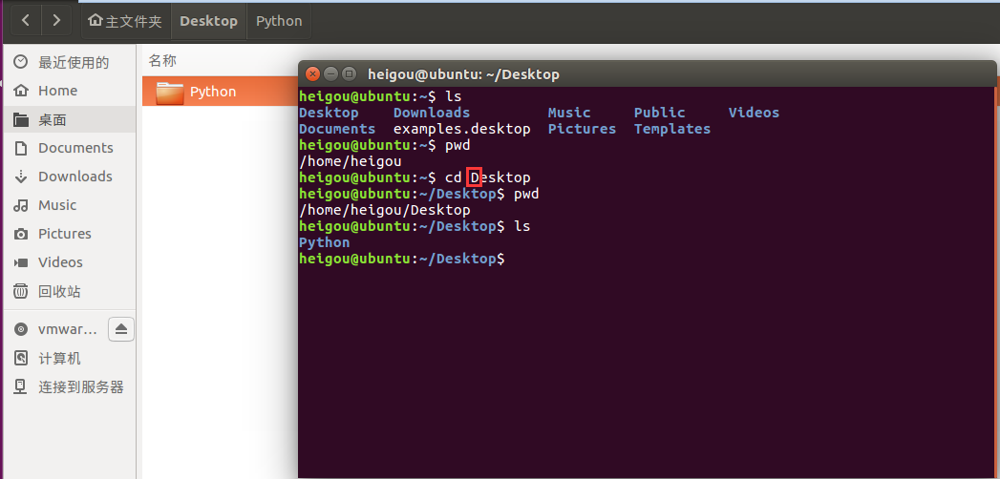
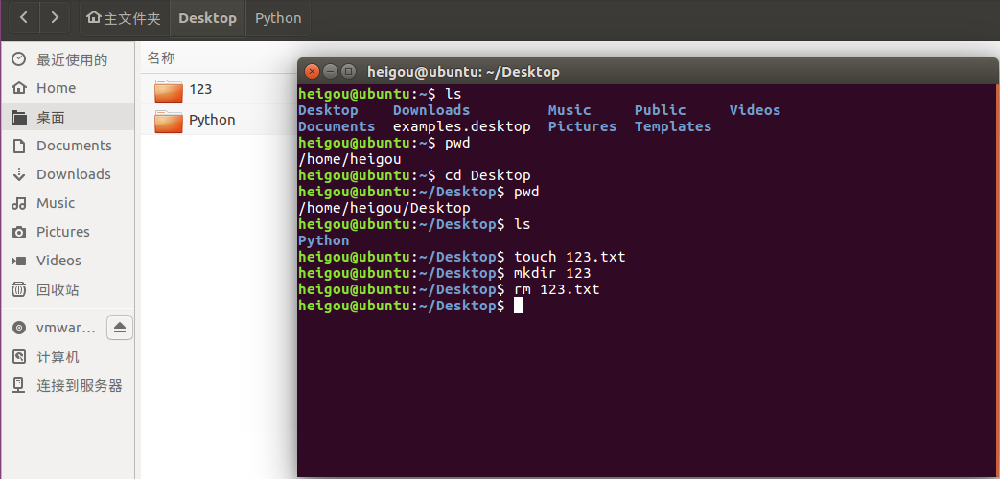
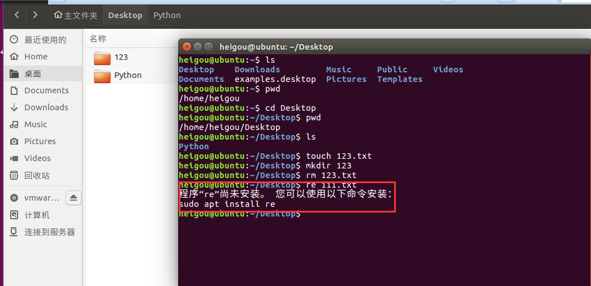
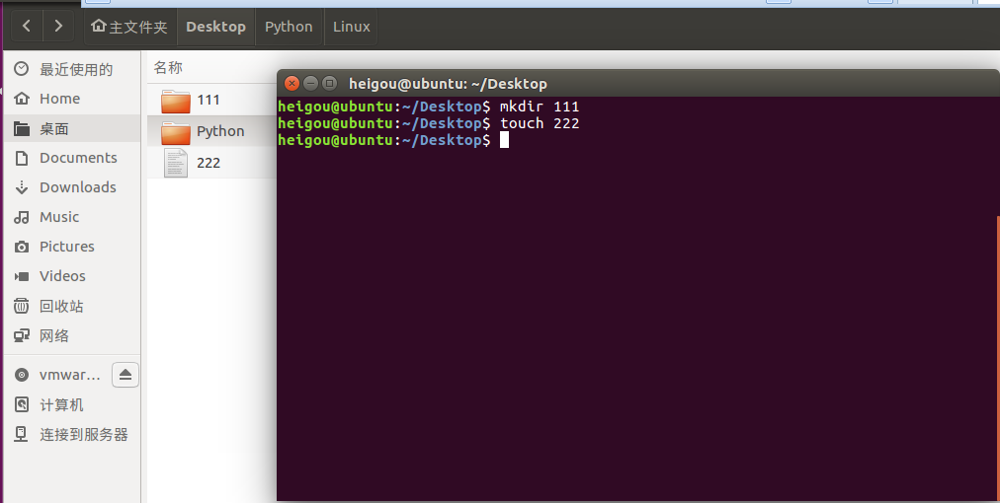

<!-- TOC depthFrom:1 depthTo:6 withLinks:1 updateOnSave:1 orderedList:0 -->

- [常用Linux命令的基本使用](#常用linux命令的基本使用)
	- [目标](#目标)
		- [学习Linux终端命令的原因](#学习linux终端命令的原因)
		- [常用Linux命令的基本使用](#常用linux命令的基本使用)
			- [01	ls	list查看当前文件夹下的内容](#01-ls-list查看当前文件夹下的内容)
			- [02 pwd	print wrok directory	查看当前所在文件夹](#02-pwd-print-wrok-directory-查看当前所在文件夹)
			- [03 cd [目录名]	change dictionary	切换文件夹](#03-cd-目录名-change-dictionary-切换文件夹)
			- [04 touch [文件名]](#04-touch-文件名)
			- [05	mkdir [目录名]	make directory	创建目录](#05-mkdir-目录名-make-directory-创建目录)
			- [06	rm [文件名]	remove	删除指定的文件名](#06-rm-文件名-remove-删除指定的文件名)
			- [07	clear	clear	清屏](#07-clear-clear-清屏)
- [Linux终端命令格式](#linux终端命令格式)

<!-- /TOC -->
# 常用Linux命令的基本使用

## 目标

**理解学习Linux终端命令的原因**

**常用Linux命令体验**
### 学习Linux终端命令的原因

（1）Linux刚面世并没有图形界面，所有的操作全靠指令完成，如磁盘操作、文件读取、目录操作、进程管理、文件权限设定等

（2）在职场中大量的
**服务器维护工作**都在在远程通过
**SSH客户端**来完成的，并没有图形界面。所有的维护工作都需要通过命令来完成

（3）在职场中，作为后端程序员，必须或多或少的掌握一些Linux常用的命令终端

（4）Linux发行版本的命令大概有200多个，但是常用的命令只有10多个
### 常用Linux命令的基本使用

**小技巧**：

ctrl + shift + = 放大终端窗口字体（为了得到Ctrl+ 所以需要加上shfit按键）

ctrl - 缩小终端窗口字体

**使用markdown语言制作表格** [参考网址](http://xianbai.me/learn-md/article/extension/table.html)

|序号| 命令 |对应英文|作用 |
|:---|:---|:---|:---|
|01   |ls   |list   |查看当前文件夹下的内容   |
|02   |pwd   |print wrok directory   |查看当前所在文件夹   |
|03   |cd [目录名]   |change dictionary   |切换文件夹   |
|04   |touch [文件名]   |touch   |如果文件不存在，新建文件   |
|05   |mkdir [目录名]   |make directory   | 创建目录  |
|06   |rm [文件名]   |remove   |删除指定的文件名   |
|07   |clear   |clear   |清屏   |

#### 01	ls	list查看当前文件夹下的内容

#### 02 pwd	print wrok directory	查看当前所在文件夹

#### 03 cd [目录名]	change dictionary	切换文件夹

**Linux 区分大小写，所以Desktop需要大写**

#### 04 touch [文件名]

#### 05	mkdir [目录名]	make directory	创建目录

#### 06	rm [文件名]	remove	删除指定的文件名

**rm最直接的就是删除文件，对目录的删除还需要其他操作**

#### 07	clear	clear	清屏

+ 可以用ctrl+l替代clear

# Linux终端命令格式

**command [-options] [parameter]**(三者之间的空格是必须的)

**说明**

（1）command: 命令名，相应功能的英文单词或单词的缩写

（2）-options：选项，可用来对命令进行控制，也可以省略

    rm-r 文件名

 **rm最直接的就是删除文件**

（3）parameter：传给命令参数，个数可以是0、1、多个

    touch 文件名称 、 cd 目录名称** , 这些都属于parameter

[ ]代表可选填，比如ls、pwd、clear这类命令可以没有options和parameter
