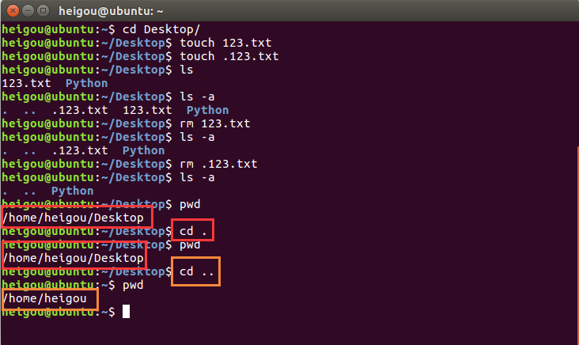
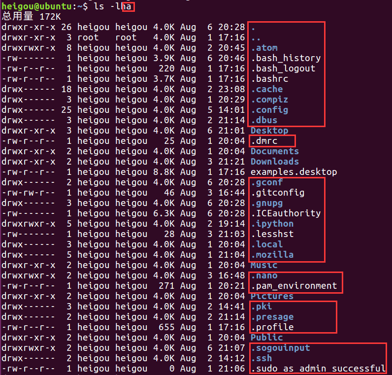
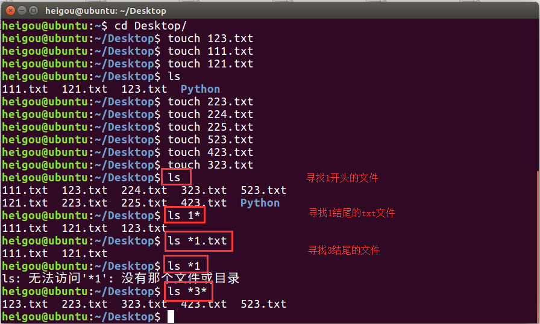
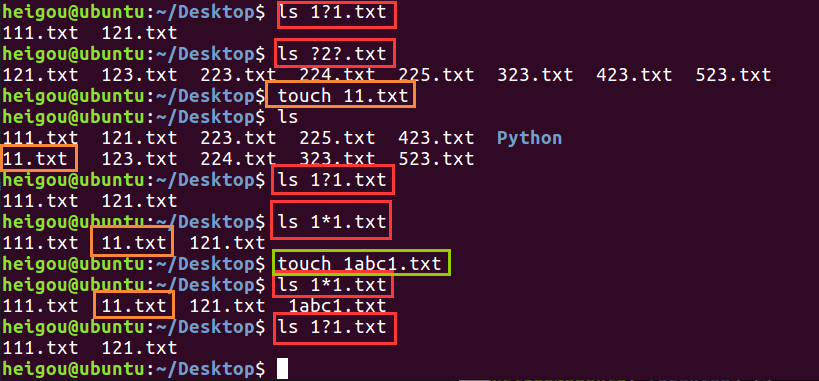
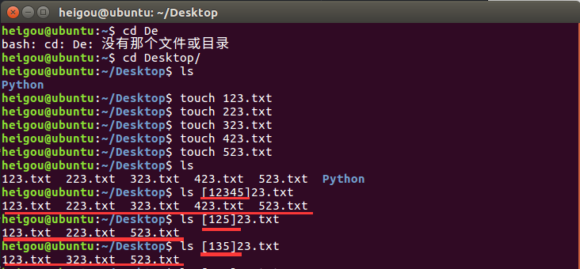
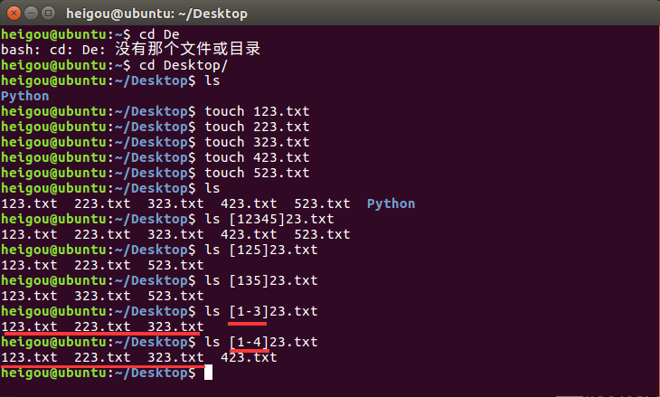
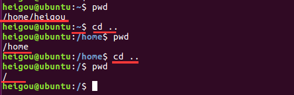
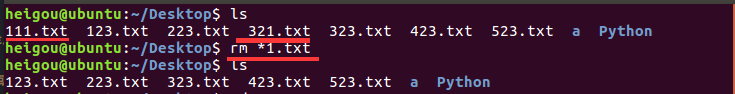
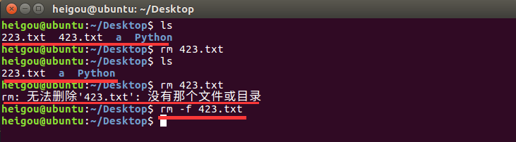
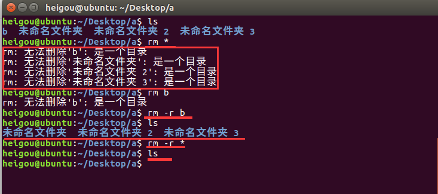

# 文件和目录常用命令

## 终端实用技巧

### 在敲出文件/目录/命令的前几个字母之后，按下tab键

（1）如果输入没有歧义，系统会自动补全

（2）如果还存在其他文件/目录/命令，再按一下tab键，系统会提示可能存在的命令

### 曾经使用过的命令

（1）按上/下光标键可以在曾经使用过的命令之间来回切换

（2）如果想要退出选择，并且不想执行当前选中的命令，可以按ctrl+c

## ls命令说明

**ls是英文单词list的简写，起功能为列出目录的内容，是用户最常用的目录之一，类似于dos下的dir命令**

### Linux下文件和目录的特点

（1）Linux文件或者目录名称最长可以有256个字符

（2）以 . 开头的文件为隐藏文件，需要用-a参数才能显示

（3）. 代表当前目录， .. 代表上一级目录

## ls常用选项

|参数|含义|
|:---|:---|
|-a   | 显示指定目录下所有子目录与文件，包括隐藏文件  |
|-l   |以列表方式显示文件的详细信息   |
|-h   |配合-l 以人性化的方式显示文件大小   |

### ls -l

### ls -h和 ls -l的配合

**-h必须要搭配-l使用，至于顺序的问题，是无所谓的；-h，-l，-a搭配使用，可以体现全部的效果**

**（科普）计算机中文件大小的表示方式**

|单位|英文|含义|
|:---|:---|:---|
|字节  |B（byte）   |在计算机中作为一个数字单元，一般为8位二进制数   |
|千   |K（Kibibyte）   |1KB = 1024B，千字节（1024 = 2 ** 10）   |
|兆   |M（Mebibyte）   |1MB = 1024KB，百万字节   |
|千兆   |G（Gigabyte） |1GB = 1024MB，十亿字节，千兆字节   |
|太   |T（Terabyte）   |1TB = 1024GB，万亿字节，太字节   |
|拍   |P（Petebyte）   |1PB = 1024TB，前万亿字节，拍字节   |
|艾   |E（Exabyte）   |1EB = 1024PB，百亿亿字节，艾字节   |
|泽   |Z（Zattabyte）   |1ZB = 1024EB，十万亿字节，泽字节   |
|尧   |Y（Yottabyte）   |1YB = 1024ZB，一亿亿字节，尧字节   |

## ls和通配符的使用

|通配符|含义|
|:---|:---|
|*   |代表任意个数字符,包括0个   |
|？   |代表任意一个字符，至少一个   |
|[ ]   |表示可以匹配字符组中的任意一个   |
|[abc]   |匹配a、b、c中的任意一个   |
|[a-f]   |匹配从a到f范围内的任意一个   |

#### *	代表任意个数字符,包括0个

#### ？	代表任意一个字符，至少一个

#### [ ]	表示可以匹配字符组中的任意一个，[abc]	匹配a、b、c中的任意一个

## [a-f]	匹配从a到f范围内的任意一个

## 切换目录

### cd
**cd是英文单词change directory 的简写，其功能为更改当前的工作目录，也是常用的命令之一**
**Linux所有的目录和文件名都是大小写敏感的**

|命令|含义|
|:---|:---|
|cd   |切换到当前用户的主目录（/home/用户目录）   |
|cd~  |切换到当前用户的主目录（/home/用户目录）   |
|cd .   |保持在当前目录不变   |
|cd ..   |切换到上级目录   |
|cd -   |可以在最近两次工作目录之间切换   |

#### cd && cd ~ 切换到当前用户的主目录（/home/用户目录)

  $前面的“~”表示根目录的意思

#### cd .	保持在当前目录不变

#### cd ..	切换到上级目录

#### cd -	可以在最近两次工作目录之间切换

## 相对路径和绝对路径

**（1）相对路径 在输入路径时，最前面不是/或者~,表示相对当前目录所在的目录位置**

**（2）绝对路径 在输入路径时，最前面是/或者~,表示从根目录/家目录开始的具体目录位置（绝对路径用“/”表示）**

## 创建和删除操作

### touch

**创建文件或修改文件时间**
（1）如果文件不存在，可以创建一个空白文件
（2）如果文件已经存在，可以修改文件的末次修改日期

### mkdir 创建一个新的目录

|选项|含义|
|:---|:---|
|-p   |可以递归创建目录   |

 

**Linux下，使用mkdir新建目录的名称不能与当前目录中已有的目录或文件同名**

## rm 删除文件或目录

**使用rm删除目录，，文件删除后不能恢复，被删除的文件没有被放在回收站中**

|选项|含义|
|:---|:---|
|-f   |强制删除，忽略不存在的文件，无需提示   |
|-r   |递归地删除目录下的内容，删除文件夹时必须加此参数   |

### rm 也可以和通配符搭配

### -f 强制删除
**如果有文件存在就直接删掉，如果没有文件存在也不会提示**

### rm -r——可使用与删除文件夹（目录）

