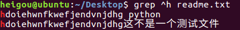
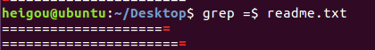
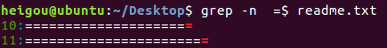
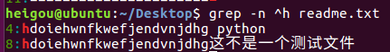

# 查看文件内容

|序号|命令|对应英文|作用|
|:---|:---|:---|:---|
| 01  |cat 文件名   |concatenate   |查看文件内容、创建文件、文件合并、追加文件内容等   |
|02   |more 文件名   |more   |分屏显示文件内容   |
|03   | grep 搜索文本文件名  |grep   | 搜索文本文件内容  |

## cat

+ cat命令可以用来查看文件内容、创建文件、文件合并、追加文件内容等功能
+ cat会一次性显示所有内容，适合查看内容较少的文本文件

|选项|含义|
|:---|:---|
|-b   |对非空输出行编号   |
|-n   |对所有的行编号   |

**Linux中有一个 nl 的命令和 cat -b 的效果等价**

+ -b	对非空输出行编号

```
heigou@ubuntu:~/Desktop$ cat -b readme.txt
     1	这是一个测试文件

     2	这不是一个测试文件
     3	hdoiehwnfkwefjendvnjdhg

     4	这不是一个测试文件
     5	hdoiehwnfkwefjendvnjdhg这不是一个测试文件

     6	=====================
     7	=======================
```
+ -n	对所有的行编号

```

heigou@ubuntu:~/Desktop$ cat -n readme.txt
     1	这是一个测试文件
     2
     3	这不是一个测试文件
     4	hdoiehwnfkwefjendvnjdhg
     5
     6	这不是一个测试文件
     7	hdoiehwnfkwefjendvnjdhg这不是一个测试文件
     8
     9	=====================
    10	=======================
    11
    12
    13
```
## more

+ more 命令可以用于分屏显示文件内容，每次只显示一页内容
+ 适合于查看内容较多的文本文件

**使用more的操作键**

|操作|功能|
|:---|:----|
|空格键   |显示手册也的下一屏   |
|Enter键 |一次滚动手册页的一行|
|b   | 回滚一屏  |
|f   |前滚一屏   |
|q   |退出   |
|/word   |搜索word字符串   |

## grep
+ Linux系统中grep命令是一种强大的文本搜索工具

```
基本搜索
heigou@ubuntu:~/Desktop$ grep python readme.txt
hdoiehwnfkwefjendvnjdhg python
```
+ grep 允许对文本文件进行模式查找，所谓模式查找，又被称为正则表达式
+
|选项|含义|
|:---|:---|
|-n   | 显示匹配行及行号  |
|-v   | 显示不包含匹配文本的所有行（相当于求反）  |
|-i   |忽略大小写   |

（1）-n	显示匹配行及行号

```
heigou@ubuntu:~/Desktop$ grep -n python readme.txt
4:hdoiehwnfkwefjendvnjdhg python
```
（2）-v	显示不包含匹配文本的所有行（相当于求反）

```
heigou@ubuntu:~/Desktop$ grep -v python readme.txt
这是一个测试文件

这不是一个测试文件

这不是一个测试文件
hdoiehwnfkwefjendvnjdhg这不是一个测试文件

=====================
=======================
```

（3）-i	忽略大小写

```
heigou@ubuntu:~/Desktop$ grep -i python readme.txt
hdoiehwnfkwefjendvnjdhg python
Python
heigou@ubuntu:~/Desktop$
```
（4）既取反，又显示行号

```
heigou@ubuntu:~/Desktop$ grep -vn python readme.txt
1:这是一个测试文件
2:
3:这不是一个测试文件
5:
6:Python
7:这不是一个测试文件
8:hdoiehwnfkwefjendvnjdhg这不是一个测试文件
9:
10:=====================
11:=======================
12:
13:
14:
```
+ 常用的两种模式查收

|参数|含义|
|:---|:---|
|^a   |行首，搜寻以a开头的行   |
|ke$  |行尾，搜寻以ke结束的行   |

（1）^a	行首，搜寻以a开头的行



(2)ke$	行尾，搜寻以ke结束的行



（3）显示以a开头行的行号



（4）显示以ke结尾的行的行号


