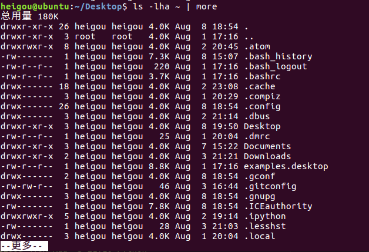

<!-- TOC depthFrom:1 depthTo:6 withLinks:1 updateOnSave:1 orderedList:0 -->

- [其他](#其他)
	- [echo 文字内容](#echo-文字内容)
	- [重定向 > 和 >>](#重定向-和-)
	- [管道 |](#管道-)

<!-- /TOC -->
# 其他

## echo 文字内容

+ echo会在终端显示参数指定的文字，通常会和重定向联合使用

```
heigou@ubuntu:~/Desktop$ echo Hello
Hello
heigou@ubuntu:~/Desktop$ echo Hello Python
Hello Python
```

## 重定向 > 和 >>

+ Linux允许将命令执行结果重定向到一个文件
+ 将本应显示在终端上的内容输出/追加到指定文件中

**其中**

+ ' > '  表示输出，会覆盖文件原有的内容

```
heigou@ubuntu:~/Desktop$ echo Hello Python > a
heigou@ubuntu:~/Desktop$ cat a
Hello Python
```

```
heigou@ubuntu:~/Desktop$ cat a
Hello Python
heigou@ubuntu:~/Desktop$ ls -lh
总用量 12K
-rw-rw-r-- 1 heigou heigou   13 Aug  8 19:50 a
drwxrwxr-x 5 heigou heigou 4.0K Aug  3 21:10 Python
-rw-rw-r-- 1 heigou heigou  222 Aug  8 18:58 readme.txt
heigou@ubuntu:~/Desktop$ ls -lh > a
heigou@ubuntu:~/Desktop$ cat a
总用量 8.0K
-rw-rw-r-- 1 heigou heigou    0 Aug  8 19:52 a
drwxrwxr-x 5 heigou heigou 4.0K Aug  3 21:10 Python
-rw-rw-r-- 1 heigou heigou  222 Aug  8 18:58 readme.txt
```

+ ' >> ' 表示追加，会将内容追加到已有文件的末尾

```
heigou@ubuntu:~/Desktop$ cat a
总用量 8.0K
-rw-rw-r-- 1 heigou heigou    0 Aug  8 19:52 a
drwxrwxr-x 5 heigou heigou 4.0K Aug  3 21:10 Python
-rw-rw-r-- 1 heigou heigou  222 Aug  8 18:58 readme.txt
heigou@ubuntu:~/Desktop$ echo Hello Python >> a
heigou@ubuntu:~/Desktop$ cat a
总用量 8.0K
-rw-rw-r-- 1 heigou heigou    0 Aug  8 19:52 a
drwxrwxr-x 5 heigou heigou 4.0K Aug  3 21:10 Python
-rw-rw-r-- 1 heigou heigou  222 Aug  8 18:58 readme.txt
Hello Python
```

## 管道 |
+ Linux允许将一个命令的输出可以通过管道做为另一个命令的输入
+ 可以理解现实生活的管子，管子的一头塞进去，另一头取出来，这里|的左右分为两级，左端塞东西（写），右端取东西（读）

**常用的管道命令有:**

+ more : 分屏显示内容



+ grep ：在命令执行结果的基础上查询指定的文本

```
heigou@ubuntu:~/Desktop$ ls -lha ~ | grep Do
drwxr-xr-x  3 heigou heigou 4.0K Aug  7 15:22 Documents
drwxr-xr-x  2 heigou heigou 4.0K Aug  3 21:21 Downloads
heigou@ubuntu:~/Desktop$ ls -lha ~ | grep Vi
drwxr-xr-x  2 heigou heigou 4.0K Aug  1 20:04 Videos
```
