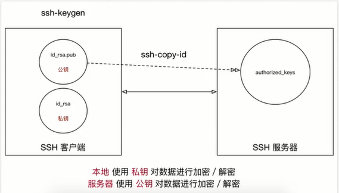
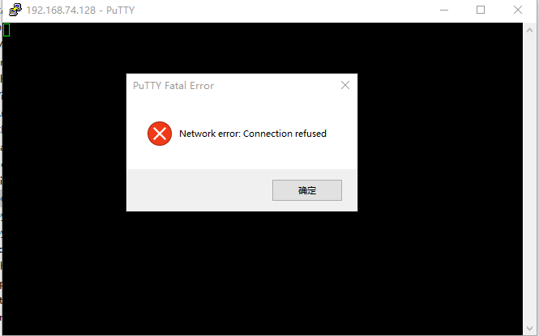
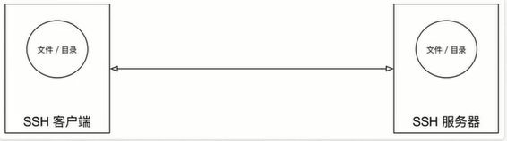

# 远程管理常用命令

## 关机/重启

|序号|命令|对应英文|作用|
|:---|:---|:---|:---|
|01   |shutdown 选项 时间   |shutdown   | 关机/重新启动   |

### shutdown
+ shutdown 命令可以安全关闭或者重新启动系统

|选项|含义|
|:---|:---|
|-r   |重新启动   |
```
heigou@ubuntu:~$ shutdown
Shutdown scheduled for Wed 2018-08-08 20:12:34 CST, use 'shutdown -c' to cancel.
heigou@ubuntu:~$ shutdown -c
heigou@ubuntu:~$ shutdown -r now
```

**提示:**
+ 不指定选项和参数，默认表示1分钟之后关闭电脑

```
heigou@ubuntu:~$ shutdown
Shutdown scheduled for Wed 2018-08-08 20:12:34 CST, use 'shutdown -c' to cancel.
heigou@ubuntu:~$ shutdown -c
```
+ 远程维护服务器时，最好不要关闭系统，而应该重新启动系统

+ 常用命令示例

```
# 重新启动操作系统，其中 now 表示现在
$ shutdown -r now

# 立刻关机，其中 now 表示现在
$ shutdown now

# 系统在今天的 22:22 会关机
$ shutdown 22:22

# 系统再过十分钟之后会自动关机
$ shutdown +10

#取消之前指定的关机计划（当执行 $ shutdown 时需在一分钟之内执行一下命令）
$ shutdown -c
```

## 查看或配置网卡信息

|序号|命令|对应英文|作用|
|:---|:---|:---|:---|
|01   |ifconfig   |configure a network interface   |查看/配置计算机当前的网卡配置信息   |
|02   |ping ip地址   |ping   |检测到目标ip地址的连接是否正常   |
### 网卡和IP地址
#### 网卡
+ 网卡是一个专门负责网络通讯的硬件设备
+ IP地址是设置在网卡上的地址信息

例如可以把电脑比作电话，网卡相当于SIM卡，IP地址相当于电话号码

**IP地址**
+ 注意：每台电脑的IP地址不能相同，否则会出现IP地址冲突，并且没有办法正常通讯

### ifconfig 查看/配置计算机当前的网卡配置信息
#### 查看网卡配置信息

```
heigou@ubuntu:~$ ifconfig
ens33     Link encap:以太网  硬件地址 00:0c:29:63:eb:6c  
          inet 地址:192.168.74.128  广播:192.168.74.255  掩码:255.255.255.0
          inet6 地址: fe80::e52c:745:50a0:40e6/64 Scope:Link
          UP BROADCAST RUNNING MULTICAST  MTU:1500  跃点数:1
          接收数据包:154 错误:0 丢弃:0 过载:0 帧数:0
          发送数据包:145 错误:0 丢弃:0 过载:0 载波:0
          碰撞:0 发送队列长度:1000
          接收字节:141690 (141.6 KB)  发送字节:16286 (16.2 KB)

lo        Link encap:本地环回  
          inet 地址:127.0.0.1  掩码:255.0.0.0
          inet6 地址: ::1/128 Scope:Host
          UP LOOPBACK RUNNING  MTU:65536  跃点数:1
          接收数据包:218 错误:0 丢弃:0 过载:0 帧数:0
          发送数据包:218 错误:0 丢弃:0 过载:0 载波:0
          碰撞:0 发送队列长度:1000
          接收字节:17801 (17.8 KB)  发送字节:17801 (17.8 KB)
```
#### 查看网卡对应的IP地址
+ 为了快速定位 inet 地址

```
heigou@ubuntu:~$ ifconfig | grep inet
          inet 地址:192.168.74.128  广播:192.168.74.255  掩码:255.255.255.0
          inet6 地址: fe80::e52c:745:50a0:40e6/64 Scope:Link
          inet 地址:127.0.0.1  掩码:255.0.0.0
          inet6 地址: ::1/128 Scope:Host
```
**提示：** 一台计算机中可能会有一个物理网卡和多个虚拟网卡，在Linux中物理网卡的名字通常以 enaXX表示

+ 127.0.0.1 被称为本地回环/环回地址，一般用来测试本机网卡是否正常

### ping

```
# 检测到目标主机是否连接正常
$ ping IP地址

# 检测本地网卡工作正常
$ ping 127.0.0.1

heigou@ubuntu:~$ ping 127.0.0.1
PING 127.0.0.1 (127.0.0.1) 56(84) bytes of data.
64 bytes from 127.0.0.1: icmp_seq=1 ttl=64 time=0.023 ms
64 bytes from 127.0.0.1: icmp_seq=2 ttl=64 time=0.047 ms
64 bytes from 127.0.0.1: icmp_seq=3 ttl=64 time=0.029 ms
64 bytes from 127.0.0.1: icmp_seq=4 ttl=64 time=0.030 ms
64 bytes from 127.0.0.1: icmp_seq=5 ttl=64 time=0.028 ms
64 bytes from 127.0.0.1: icmp_seq=6 ttl=64 time=0.036 ms
64 bytes from 127.0.0.1: icmp_seq=7 ttl=64 time=0.029 ms
64 bytes from 127.0.0.1: icmp_seq=8 ttl=64 time=0.028 ms
^C
--- 127.0.0.1 ping statistics ---
8 packets transmitted, 8 received, 0% packet loss, time 7149ms
rtt min/avg/max/mdev = 0.023/0.031/0.047/0.007 ms
```

+ ping 一般用于检测当前计算机到目标计算机之间的网络是否通畅，数值越大，速度越大
+ ping 的工作原理与潜水艇的声纳相似，ping这个命令就是取自声纳的声音
+ 网络管理员之间也常将 ping 做动词

**原理：网络上的机器都有唯一确定的IP地址，我们给目标IP地址发送一个数据包，对方就要返回一个数据包，根据返回的数据包以及时间，我们可以确定目标主机的存在**

**提示：** 在Linux中，想要终止一个终端程序的执行，绝大多数都可以使用
**ctrl+c**

# 远程登录和复制文件

|序号|命令|对应英文|作用|
|:---|:---|:---|:---|
|01   |ssh 用户名@ip   |secure shell   |关机/重新启动   |
|02   |scp 用户名@ip：文件名或路径 用户名@ip：文件名或路径   |secure copy   |远程复制文件   |

## ssh基础
在Linux中SSH是非常常用的工具，通过SSH客户端我们可以连接到运行了SSH服务器的远程机器上

**mac和ubuntu系统的SSH的客户端都是默认安装的，Windows系统需要自行安装SSH客户端**



+ SSH客户端是一种使用Secure Shell（SSH）协议连接到远程计算机的软件程序、
+ SSH是目前较可靠，专为远程登录会话和其他网络服务提供安全的协议
  + 利用SSH协议可以有效防止远程管理过程中的信息泄露
  + 通过SSH协议可以对所有传输的数据进行加密，也能够防止DNS欺骗和IP欺骗
+ SSH的另一项优点是传输的数据可以是经过压缩的，所以可以加快传输的速度

**1）域名和端口号**

**域名**
+ 由一串用点分隔的名字组成，例如：www.itcast.cn
+ 是IP地址的别名，方便用户记忆
  + www.baidu.com则是百度的域名，而119.75.213.61是百度的IP地址
```
heigou@ubuntu:~/Desktop$ ping www.baidu.com
PING www.a.shifen.com (119.75.213.61) 56(84) bytes of data.
64 bytes from 119.75.213.61: icmp_seq=1 ttl=128 time=30.2 ms
64 bytes from 119.75.213.61: icmp_seq=2 ttl=128 time=30.4 ms
64 bytes from 119.75.213.61: icmp_seq=3 ttl=128 time=30.2 ms
^C
--- www.a.shifen.com ping statistics ---
3 packets transmitted, 3 received, 0% packet loss, time 2003ms
rtt min/avg/max/mdev = 30.201/30.309/30.465/0.181 ms
```

**端口号**
+ IP地址：通过IP地址找到网络上的计算机
+ 端口号：通过端口号可以找到计算机运行的应用程序
  + SSH服务器的默认端口号是 22 ，如果是默认端口号，在连接的时候，可以省略
  ——以百度为例：119.75.213.61 = 119.75.213.61：80
+ 常见服务器端口号列表：

|序号|服务|端口号|
|:---|:---|:---|
|01   |SSH服务器   |22   |
|02   |Web服务器   |80   |
|03   |HTTPS   |443   |
|04   |FTP服务器   |21   |

**2) SSH客户端的简单使用**

```
ssh [-p port] user@remote
```
+ user 是在远程机器上的用户名，如果不指定的话默认为当前用户
+  remote 是远程机器的地址，可以是IP/域名，或者是后面会提到的别名
+ port 是SSH Server 监听的端口，如果不指定，就为默认值 22

**注意：**
+ ssh终端命令只能在Linux或者UNIX系统下使用
+ 如果在Windows系统中，可以安装PuTTY或者XShell客户端软件即可

**在mac中使用ssh命令登录heigou用户Ubuntu系统**
```
ssh -p 22 heigou@192.168.74.128
```

+ 此时可通过 ifconfig | grep inet 获取IP地址
  ```
  heigou@ubuntu:~$ ifconfig | grep inet
          inet 地址:192.168.74.128  广播:192.168.74.255  掩码:255.255.255.0
          inet6 地址: fe80::e52c:745:50a0:40e6/64 Scope:Link
          inet 地址:127.0.0.1  掩码:255.0.0.0
          inet6 地址: ::1/128 Scope:Host
  ```

**3) Windows下SSH客户端的安装**

+ Putty[下载地址](https://www.chiark.greenend.org.uk/~sgtatham/putty/latest.html)



+ XShell[下载地址](http://www.netsarang.com/products/xsh_overview.html)

**以上两款软件均是免费软件，故在官网上下载安全可靠**

**提示：**
+ 使用exit退出当前用户的登录

## scp
+ scp 是secure copy ，是一个在Linux下用来进行远程拷贝文件的命令
+ 它的格式与ssh基本相同，需要注意的是，在指定端口时用的是大写的 **-P** 而不是小写的



```
# 把本地当前目录下的1.py 文件 复制到 远程 家目录下的Desktop/1.py
# 注意： ‘：’后面的路径如果不是绝对路径，则以用户的家目录作为参照路径

scp -P port 1.py user@remote：Desktop/1.py

# 把远程 家目录下的 Desktop/1.py 文件 复制到 本地当前目录下的 1.py

scp -P port user@remote：Desktop/1.py 1.py

# 加上 -r 选项 可以传送文件夹
# 把当前目录下的 demo 文件夹复制到 远程 家目录下的Desktop

scp -r demo user@remote：Desktop

# 把远程 家目录下的Desktop 复制到当前目录下的 demo文件

scp -r user@remote：Desktop demo
```

|选项|含义|
|:---|:---|
|-r   |若给出的源文件是目录文件，则scp 将递归复制该目录下的所有子目录和文件，目标文件必须为一个目录名   |
|-p   |若远程SSH服务器的端口不是22，需要使用大写字母 -P选项指定端口   |

### ？scp命令只能在mac or Linux 系统下使用

## FileZilla
+ [官方网站](https://filezilla-project.org/)
+ FileZilla 在传输文件时，使用的是FTP服务 而不是 SSH 服务，因此端口号应该设置为 21

**也可使用 Xftp**

## SSH高级

+ 免密码登录
+ 配置别名
**提示：** 有关SSH配置信息都保存在用户家目录下的.ssh 家目录下的

**1）免密码登录**
**步骤**
+ 配置公钥
  + 执行 ssh-keygen即可生成SSH钥匙，一路回车即可
+ 上传公钥到服务器
  + 执行 ssh-copy-id -p port user@remote， 可以让远程服务器记住公钥

**示意图**


> 非对称加密算法
> + 使用公钥加密的数据，需要使用私钥解密
> + 使用私钥加密的数据，需要使用公钥解密

**配置别名**

每次输入 ssh-p port user@remote， 时间久了就很麻烦，特别是当user，remote 和port都需要输入，且不好记忆

+ 而配置别名 可以让我们很方便，譬如用：ssh lyl 来代替上面的命令，那么就在~/.ssh/config 里面追加以下内容：
```
Host lyl
    HostName ip地址
    User heigou
    Port 22
```
**保存之后，即可使用 ssh lyl 实现远程登录了， scp同样可以使用**
