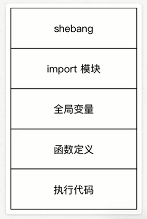

<!-- TOC depthFrom:1 depthTo:6 withLinks:1 updateOnSave:1 orderedList:0 -->

- [变量的进阶](#变量的进阶)
	- [变量的引用](#变量的引用)
		- [引用的概念](#引用的概念)
		- [函数的参数和返回值的传递](#函数的参数和返回值的传递)
	- [可变和不可变型](#可变和不可变型)
	- [局部变量和全局变量](#局部变量和全局变量)
		- [局部变量](#局部变量)
		- [全局变量](#全局变量)

<!-- /TOC -->
# 变量的进阶
## 变量的引用
> + 变量和数据都是保存在内存中的
> + 在Python中函数的参数传递以及返回值都是靠引用传递的

### 引用的概念
在Python中
+ 变量和数据是分开存储的
+ 数据保存在内存中的一个位置
+ 变量中保存着数据在内存中的地址
+ 变量中记录数据的地址，就叫做引用
+ 使用id()函数可以查看变量中保存数据所在的内存地址

> 注意： 如果变量已经被定义，当给一个变量赋值时，本质上是修改了数据的引用
> + 变量不再对之前的数据引用
> + 变量改为对新赋值数据的引用

```python
In [1]: a = 1
In [2]: id(a)
Out[2]: 10919424
In [3]: id(1)
Out[3]: 10919424
In [4]: b = a
In [5]: id(b)
Out[5]: 10919424
In [6]: a = 2
In [7]: id(a)
Out[7]: 10919456
In [8]: id(b)
Out[8]: 10919424
In [9]: b = a
In [10]: id(b)
Out[10]: 10919456
```
### 函数的参数和返回值的传递
在Python中，函数的实参/返回值都是靠引用传递来的
```python
  def test(num):
    print("在函数内部 %d 对应的内存地址是%d " %(num,id(num)))
    # >1 定义一个字符串变量
    result = "hello"
    print("函数要返回数据的内存地址是%d" % id(result))
    # >2 将字符串变量返回,函数返回的是数据的引用，而不是数据本身
    return result
  # 1.定义一个数字的变量
  a = 10
  # 数据的地址本质上就是一个数字
  print("a变量保存数据的内存地址是%d" %id(a))
  # 2.调用test函数，本质上传递的是实参保存数据的引用，而不是实参保存的数据！
  # 注意：如果函数有返回值，但是没有定义变量接收
  # 程序不会报错，但是无法获得返回结果
  r = test(a)
  print("%s的内存地址是%d" %(r,id(r)))
```
## 可变和不可变型
+ 不可变型，内存中的数据不允许被修改:
  - 数字类型 int，bool，float，complex，long（2，x） # (2, x)是啥意思？
  - 字符串 str
  - 元组 tuple
+ 可变类型，内存中的数据不允许被修改：  # 这句话写错了
  - 列表 list
  - 字典 dict


```python
In [1]: # 列表
In [2]: a = [1,2,3]
In [3]: id(a)
Out[3]: 139929865061768
In [4]: a.append(888)
In [5]: a
Out[5]: [1, 2, 3, 888]
In [6]: id(a)
Out[6]: 139929865061768
In [7]: a.remove(2)
In [8]: a
Out[8]: [1, 3, 888]
In [9]: id(a)
Out[9]: 139929865061768
In [10]: a.clear
Out[10]: <function list.clear>
In [11]: a.clear()
In [12]: id(a)
Out[12]: 139929865061768
In [13]: a
Out[13]: []
In [14]: a = []
In [15]: id(a)
Out[15]: 139929865098696
In [16]: # 字典
In [17]: d = {"name":"xiaoming"}
In [18]: d
Out[18]: {'name': 'xiaoming'}
In [19]: d["age"] = 18
In [20]: d
Out[20]: {'name': 'xiaoming', 'age': 18}
In [21]: id(d)
Out[21]: 139929865101256
In [22]: d.pop("age")
Out[22]: 18
In [23]: d
Out[23]: {'name': 'xiaoming'}
In [24]: id(d)
Out[24]: 139929865101256
In [25]: d.clear()
In [26]: id(d)
Out[26]: 139929865101256
In [27]: d = {}
In [28]: id(d)
Out[28]: 139929865052680
```
> 注意：字典的key只能使用不可变类型的数据

**注意**
1. 可变类型的数变化，是通过方法来实现的
2. 如果给一个可变类型的变量，赋值了一个新的数据，引用会修改
  + 变量不再对之前的数据引用
  + 变量改为对新赋值的数据引用

**哈希（hash）**
+ python中内置有一个hash（o）函数
  - 接收一个不可变类型的数据作为函数
  - 返回结果是一个整数
+ 哈希是一种算法，其作用就是提取数据类型的特征码（类似于指纹）
  - 相同的内容得到相同的结果
  - 不同的内容得到不同的结果
+ 在python中，设置字典的键值对时，首先对key进行hash已决定如何在内存中保存字典的数据，以方便后续对字典的操作:增、删、改、查
  - 键值对的key必须是不可变类型数据
  - 键值对的value可以是任意类型的数据

```python
In [1]: d = {}
In [2]: d["name"] = "xiaoming"
In [3]: d["1"] = "整数"
In [4]: d
Out[4]: {'name': 'xiaoming', '1': '整数'}
In [5]: d[(1,)] = "整数"
In [6]: d[[1,2,3]] = "列表"
---------------------------------------------------------------------------
TypeError                                 Traceback (most recent call last)
<ipython-input-6-184ccaf06b98> in <module>()
----> 1 d[[1,2,3]] = "列表"

TypeError: unhashable type: 'list'

In [7]: d[{"n":"xxx"}] = "字典"
---------------------------------------------------------------------------
TypeError                                 Traceback (most recent call last)
<ipython-input-7-397e5cf0ea61> in <module>()
----> 1 d[{"n":"xxx"}] = "字典"

TypeError: unhashable type: 'dict'

In [8]: hash(1)
Out[8]: 1
In [10]: hash("hello")
Out[10]: -4504525527338452810
In [11]: hash("hello")
Out[11]: -4504525527338452810
In [12]: hash("hello1")
Out[12]: -8420205507634319855
In [13]: hash((1,))
Out[13]: 3430019387558
In [14]: hash([])
---------------------------------------------------------------------------
TypeError                                 Traceback (most recent call last)
<ipython-input-14-6420c1e61a67> in <module>()
----> 1 hash([])

TypeError: unhashable type: 'list'

In [15]: hash({})
---------------------------------------------------------------------------
TypeError                                 Traceback (most recent call last)
<ipython-input-15-c8fd4c7a4881> in <module>()
----> 1 hash({})

TypeError: unhashable type: 'dict'
```
## 局部变量和全局变量
+ 局部变量是在函数内部定义的变量，只能在函数内部使用
+ 全局变量是在函数外部定义的变量（没有定义在某一个函数内），所有函数内部都可以使用这个变量
> 提示：在其他的开发语言中大多 **不推荐使用全局变量** -- 可变范围太大，导致程序不好维护！

### 局部变量
+ 局部变量是在函数内部定义的变量，只能函数内部使用
+ 函数执行结束后，函数内部的局部变量，会被系统收回
+ 不同的函数，可以定义相同名字的局部变量，但是各用各的不会产生影响

**局部变量的作用**
+ 在函数内部使用，临时保存函数内部需要使用的数据

```python
  def demo1():
    # 定义一个局部变量
    num  = 10
    print("在demo1函数内部的变量是%d" % num)

  def demo2():
    # print("在demo1函数内部的变量是%d" % num)
    pass
  # 在函数内部定义的变量，不能在其他位置使用
  print("%d" %num)
  demo1()
  demo2()

  # 结果
  Traceback (most recent call last):
    File "/home/heigou/Desktop/Python_code/07_语法进阶/hg_02_局部变量.py", line 11, in <module>
      print("%d" %num)
  NameError: name 'num' is not defined
```

**局部变量的生命周期**
+ 所谓生命周期就是从被创建到系统回收的过程
+ 局部变量在函数执行时才会被创建
+ 函数执行结束后局部变量被系统回收
+ 局部变量在生命周期内，可以用来存储函数内部临时使用到的数据

```python
def demo1():
  # 定义一个局部变量
  # 1> 出生：执行了下方的代码之后，才会被创建
  # 2> 死亡：函数执行完成之后
  num  = 10
  print("在demo1函数内部的变量是%d" % num)
demo1()
```

### 全局变量
+ 全局变量是在函数外部定义的变量，所有的函数内部都可以使用这个变量
```python
  #  全局变量
  num = 10
  def demo1():
      print("demo1 ==> %d" % num)
  def demo2():
      print("demo1 ==> %d" % num)
  demo1()
  demo2()
```
**注意：** 函数执行时，需要处理变量时会
1. 首先查找函数内部是否存在指定名称的局部变量，如果有，直接使用
2. 如果没有，查找函数外部是否存在指定名称的全局变量，如果有，直接使用
3. 如果还没有，程序报错！

**1）函数不能直接修改全局变量的引用**
+ 全局变量是在函数外部定义的变量（没有定义在某一个函数内），所有函数内部都可以使用这个变量
> 提示：在其他的开发语言中大多 **不推荐使用全局变量** -- 可变范围太大，导致程序不好维护！
+ 函数内部，可以通过全局变量的引用获取对应的数据
+ 但是，不允许直接修改全局变量的引用 -- 使用赋值语句修改全局变量的值

```python
  #  全局变量
  num = 10
  def demo1():
      # 希望修改全局变量的值
      # python中，不允许修改全局变量的值
      # 如果使用赋值语句，会在函数内部定义一个局部变量
      num = 99
      print("demo1 ==> %d" % num)
  def demo2():
      print("demo1 ==> %d" % num)
  demo1()
  demo2()

  # 结果
  demo1 ==> 99
  demo1 ==> 10
```
> 注意：只是在函数内部定义了一个局部变量而已，只是变量名相同 -- 在函数内部不能直接修改全局变量的值

**1)在函数内部修改全局变量的值**
+ 如果在函数中需要修改全局变量，需要使用global进行声明
```python
  #  全局变量
  num = 10
  def demo1():
      # 希望修改全局变量的值 -使用global 声明 变量即可
      # global关键字会告诉解释器后面的变量是一个全局变量
      # 再使用赋值语句时，就不会创建局部变量
      global num
      num = 99
      print("demo1 ==> %d" % num)
  def demo2():
      print("demo1 ==> %d" % num)
  demo1()
  demo2()

  # 结果
  demo1 ==> 99
  demo1 ==> 99
```
**3）全局变量定义的位置**
+ 为了保证所有的函数都能够正确使用到全局变量，应该将全局变量定义在其他函数的上方
```python
  # 注意： 在开发时，应该把模块中的所有全局变量
  # 定义在所有函数上方，就可以保证所有的函数
  # 都能够正常的访问到每一个全局变量
  num = 10
  def demo():
      print("%d" % num)
      print("%s" % title)
      print("%s" % name)
  # 再定义一个全局变量
  title = "黑狗程序员"
  demo()
  # 再定义一个全局变量
  name = "xm"

  # 结果
  10
  黑狗程序员
  Traceback (most recent call last):
    File "/home/heigou/Desktop/Python_code/07_语法进阶/hg_06_全局变量的位置.py", line 9, in <module>
      demo()
    File "/home/heigou/Desktop/Python_code/07_语法进阶/hg_06_全局变量的位置.py", line 5, in demo
      print("%s" % name)
  NameError: name 'name' is not defined
```
**注意**
+ 由于全局变量，是在调用函数之后，才定义的，在执行函数时，变量还没有定义，所以程序会报错！

**代码结构示意图如下**



**4）全局变量命名的建议**
+ 为了避免局部变量和全局变量出现混淆，在定义全局变量时，有些公司会有一些开发要求，例如：
+ 全局变量应该加上g_ 或者 gl_ 的前缀
```python
  # 注意： 在开发时，应该把模块中的所有全局变量
  # 定义在所有函数上方，就可以保证所有的函数
  # 都能够正常的访问到每一个全局变量
  gl_num = 10
  # 再定义一个全局变量
  gl_title = "黑狗程序员"
  # 再定义一个全局变量
  gl_name = "xm"
  def demo():
      # 如果局部全局变量的名字和全局变量的名字相同
      # PyCharm会在局部变量下方显示一个灰色的虚线
      num = 99
      print("%d" % num)
      print("%s" % gl_title)
      print("%s" % gl_name)
  demo()
```
