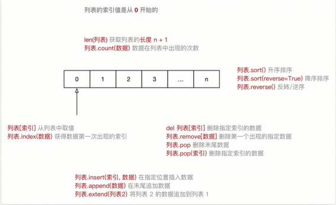
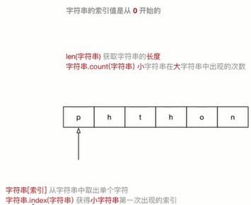
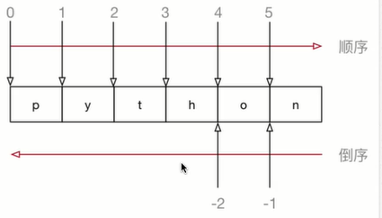

<!-- TOC depthFrom:1 depthTo:6 withLinks:1 updateOnSave:1 orderedList:0 -->

- [高级变量](#高级变量)
	- [列表](#列表)
		- [列表常用操作](#列表常用操作)
		- [循环遍历](#循环遍历)
	- [元组](#元组)
		- [元组的定义](#元组的定义)
		- [元组的常用操作](#元组的常用操作)
		- [循环遍历](#循环遍历)
		- [应用场景](#应用场景)
	- [字典](#字典)
		- [字典的定义](#字典的定义)
		- [字典的常用操作](#字典的常用操作)
		- [循环遍历](#循环遍历)
		- [应用场景](#应用场景)
	- [字符串](#字符串)
		- [字符串的定义](#字符串的定义)
		- [字符串的常用操作](#字符串的常用操作)
		- [字符串常用操作](#字符串常用操作)
		- [字符串的切片](#字符串的切片)

<!-- /TOC -->
# 高级变量
+ 非数字型变量
  - 字符串
  - 列表
  - 元组
  - 字典
+ 在Python中，所有非数字型变量都支持以下特点：
1. 都是一个序列sequence，也可以理解为容器
2. 取值[]
3. 遍历 for in
4. 计算长度、最大/最小值、比较、删除
5. 链接 + 和重复 *
6. 切片

## 列表
+ list（列表）是Python中使用最频繁的数据类型，在其他语言中通常叫做数组
+ 专门用于存储一串信息
+ 列表用 [] 定义，数据之间使用 ， 分隔
+ 列表的索引从 0 开始
  - 索引就是数据在列表中的位置编号，索引又可以被称为下标

```python
In [5]: name_list = ["zhangsan","lisi","wangwu"]

In [6]: name_list
Out[6]: ['zhangsan', 'lisi', 'wangwu']
```

> 从列表中取值时，如果超出索引范围，程序会报错



### 列表常用操作
+ 在IPython3中定义一个列表，例如：name_list = []
+ 输入name_list.按下TAB键，ipython会提示列表能够使用的方法如下：

```python
In [2]: name_list.
name_list.append   name_list.count    name_list.insert   name_list.reverse
name_list.clear    name_list.extend   name_list.pop      name_list.sort
name_list.copy     name_list.index    name_list.remove
```

|序号|分类|关键字/函数/方法|说明|
|:---|:---|:---|:---|
|1   |增加   |列表.insert(索引，数据)   |在指定位置插入数据   |
|   |   |列表.append(数据)   |在末尾追加数据   |
|   |   |列表.extend(列表2)   |将列表2的数据追加大列表   |
|2   |修改   |列表[索引] = 数据   |修改指定索引的数据   |
|3   |删除   |del 列表[索引]   |删除指定索引的数据   |
|   |   |列表.remove(数据)   |删除第一个出现的指定数据   |
|   |   |列表.pop   |删除末尾数据   |
|   |   |列表.pop(索引)   |删除指定索引数据   |
|   |   |列表.clear   |清空列表   |
|4   |统计   |len(列表)   |列表长度   |
|   |   |列表.count(数据)   |数据在列表中出现的次数   |
|5   |排序   |列表.sort()   |升序排序   |
|   |   |列表.sort(reverse=True)    |降序排序   |
|   |   |列表.reverse()   |逆序、反转   |
```python
  # 定义一个列表
  name_list = ["zhangsan","lisi","wangwu"]
  #  1. 取值和索引
  # list index out of range - 列表超出范围
  print(name_list[2])
  # 知道数据的内容，想确定数据在列表中国的位置
  # 使用index方法需要注意，如果传递的数据不在列表中，程序会报错！
  print(name_list.index("wangwu"))
  # 2. 修改
  name_list[1] = "lisilisi"
  # IndexError: list assignment index out of range
  # 列表指定的索引超出范围，程序会报错
  # name_list[3] = "王二小"

  # 3.增加
  # append 方法可以向列表的末尾追加数据
  name_list.append("wang")
  # insert 方法可以在列表的指定索引位置插入数据
  name_list.insert(1,"小帅哥")
  # extend 方法可以把其他列表中的完整内容追加到当前列表的末尾
  temp_list = ["111","222","333"]
  name_list.extend(temp_list)
  # 4. 删除
  # remove 可以从列表中删除指定的数据
  name_list.remove("wangwu")
  # pop 方法默认可以把列表中最后一个元素删除
  name_list.pop()
  # pop 方法默认可以指定要删除元素的索引
  name_list.pop(3)
  # clear 方法可以清空列表
  name_list.clear()
  print(name_list)
```
```python
	# 定义一个列表
	name_list = ["zhangsan","lisi","wangwu"]
	# 使用del关键字（delete）删除列元素
	# 提示：在日常开发中，要从列表中删除数据，建议使用列表提供的方法
	del name_list[1]

	# del关键字本质上是用来将一个变量从内存中删除
	name = "小明"
	del name
	print(name)
	print(name_list)
```
```python
	# 定义一个列表
	name_list = ["zhangsan","lisi","wangwu"]
	list_len = len(name_list)
	print("列表中包含的%d个元素" % list_len)

	# count方法可以统计列表中某一个数据出现的次数
	count = name_list.count("lisi")
	print("lisi出现了%d次" % count)
	# 从列表中删除第一次出现的数据，如果数据不存在，程序会报错
	name_list.remove("lisi")
	print(name_list)
```
```python
	# 定义一个列表
	name_list = ["zhangsan","lisi","wangwu","wangxiaoer"]
	num_list = [6,8,4,1,10]
	# 升序
	# name_list.sort()
	# num_list.sort()
	# 降序
	# name_list.sort(reverse=True)
	# num_list.sort(reverse=True)
	# 逆序（反转）
	name_list.reverse()
	num_list.reverse()
	print(name_list)
	print(num_list)
```

**关键字、函数和方法**
+ 关键字是Python内置的、具有特殊意义的标识符

```python
In [1]: import keyword

In [2]: print(keyword.kwlist)
['False', 'None', 'True', 'and', 'as', 'assert', 'break', 'class', 'continue', 'def', 'del', 'elif', 'else', 'except', 'finally', 'for', 'from', 'global', 'if', 'import', 'in', 'is', 'lambda', 'nonlocal', 'not', 'or', 'pass', 'raise', 'return', 'try', 'while', 'with', 'yield']

In [3]: len(keyword.kwlist)
Out[3]: 33
```
> 关键字后面不需要使用括号

+ 函数封装了独立功能，可以直接调用
> 函数需要死记硬背
+ 方法和函数类似,同样是封装了独立的功能
+ 方法需要通过对象来调用，表示针对这个对象要做的操作

> 在变量后面输入 . ,然后选择针对这个变量要执行的操作

### 循环遍历
+ 遍历就是从头到尾依次从列表中获取数据
	- 在循环体内部针对每一个元素，执行相同的操作
+ 在Python中为了提高列表的遍历效率，专门提供的迭代iteration遍历
+ 使用 for 就能够实现迭代遍历
```python
	name_list = ["zhangsan","lisi","wangwu","wangxiaoer"]
	# 使用迭代遍历列表
	"""
	顺序的从列表中依次获取数据，每一次循环过程中，数据都会保存在my_name
	变量中，在循环体内部可以访问到当前这一次获取到的数据
	"""
	for my_name in name_list:
	    print("my name is %s" % my_name)
```
**应用场景**
+ 尽管Python的列表中可以存储不同类型的数据
+ 但是在开发中，更多应用的场景是
	- 列表存储相同类型的数据
	- 通过迭代遍历，在循环体内部，针对列表中每一项元素，执行相同的操作

## 元组
### 元组的定义
+ Tuple（元组）与列表类似，不同之处在于元组的 **元素不能修改**
	- **元组** 表示多个元素组成的序列
	- 元组在Python开发中，有特定的应用场景
+ 用于存储一串信息、数据之间使用 **,** 分隔
+ 元组用 () 定义
+ 元组的索引从 0 开始
	- 索引就是数据元组中的位置编号

```python
In [1]: info_tuple = ("lisi",18,1.786)
In [2]: type(info_tuple)
Out[2]: tuple
In [3]: info_tuple[1]
Out[3]: 18
```

**创建空元组**
```python
tuple = （）
```
**元组中只包含一个元素时，需要在元素后面添加逗号**
```python
In [8]: single_tuple = (5)
In [9]: type(single_tuple)
Out[9]: int

In [10]: single_tuple = (5,)
In [11]: type(single_tuple)
Out[11]: tuple
```

### 元组的常用操作
+ 在ipyhon中定义一个元组
+ 输入info.按下TAB键，ipython会提示元组能够使用的函数

```python
In [1]: info = ()
In [2]: info.
info.count  info.index  
```
```python
	info_tuple = ("lisi",18,1.786)
	# 1.取值和去索引
	print(info_tuple[0])
	# 已经知道数据的内容，希望知道该数据在元组中的索引
	print(info_tuple.index("lisi"))
	# 2.统计数据
	print(info_tuple.count("lisi"))
	# 统计元组中包含元素的个数
	print(len(info_tuple))
```
### 循环遍历
+ 取值就是从元组中获取存储在指定位置的数据
+ 遍历就是从头到尾依次从元组中获取数据
```python
	info_tuple = ("lisi",18,1.786)
	# 使用迭代遍历元组
	# 使用格式字符串拼接 my_info 这个变量不方便！
	# 因为元组中通常保存的数据类型是不同的
	for my_info in info_tuple:
	    print(my_info)
```
+ 在Python中，可以使用for循环遍历所有非数字类型的变量： **列表、元组、字典以及字符串**
+ 提示：实际开发中，除非能够确认元组中数据类型，否则针对元组的循环遍历需求并不是很多

### 应用场景
+ 函数的参数和返回值：一个函数可以接收任意多个参数，或者以此返回多个数据
+ 格式字符串，格式化字符串后面的（）本质上就是一个元组

```python
	info_tuple = ("lisi",18,1.786)
	# 格式化字符串后面 ’（）‘本质上就是元组
	print("%s %d %f" % ("lisi",20,1.786))
	print("%s %d %f" % info_tuple)
	info_str = "%s %d %f" % info_tuple
	print(info_str)
	# 结果：
	lisi 20 1.786000
	lisi 18 1.786000
	lisi 18 1.786000
```
+ 让列表不可以被修改，以保护数据安全

**元组和列表之间的转换**
+ 使用list函数可以把元组转换成列表
+ 使用tuple函数可以把列表转换成元组

```python
In [1]: num_list = [1,2,3,4]
In [2]: type(num_list)
Out[2]: list
In [3]: num_tuple = tuple(num_list)
In [4]: type(num_tuple)
Out[4]: tuple
In [5]: num2_list = list(num_)
num_list   num_tuple  
In [5]: num2_list = list(num_tuple)
In [6]: type(num2_list)
Out[6]: list
```
## 字典
### 字典的定义
+ dictionary（字典）是除列表以外Python之中最灵活的数据类型
+ 字典同样可以用来存储多个数据
	- 通常用于存储描述一个物体的相关信息
+ 和列表的区别
	- 列表是有序的对象集合
	- 字典是无序的对象集合
+ 字典用 {} 定义
+ 字典使用键值对存储数据，键值对 之间 使用 ，分隔
	- 键 key 是索引
	- 值value是数据
	- 键和值之间使用 ：分隔
	- 键必须是唯一的
	- 值可以取任何数据类型，但 键只能使用字符串、数字或元组


```python
	# 字典是无序的数据结合，所以print输出无序，
	# 通常和定义的顺序是不一致的
	xiaoming = {"name":"小明",
	            "age":18,
	            "gender":True,
	            "height":1.75,
	            "weight":50}
	# 为了阅读清晰，定义时每一个键值对都各自占有一行代码`
print(xiaoming)
```
```python
	xiaoming_dict = {"name":"小明"}
	# 1.取值
	print(xiaoming_dict["name"])
	# 在取值时，如果指定的key不存在，程序会报错
	# print(xiaoming_dict["name123"])
	# 2.增加/修改
	# 如果key不存在，会新增键值对
	xiaoming_dict["age"] = 18
	# 如果key存在。会修改已近存在的键值对
	xiaoming_dict["name"] = "xxm"
	# 3.删除
	xiaoming_dict.pop("name")
	# 再删除指定键值时，如果指定键值key不存在，程序会报错
	# xiaoming_dict.pop("name123")
	print(xiaoming_dict)
```
### 字典的常用操作
+ 在ipthon3中定义一个字典，例如：xiaoming = {}
+ 输入xiaoming. 按下TAB键，ipython会提示字典能够使用的函数如下：

```python
In [1]: xiaoming = {}
In [2]: xiaoming.
xiaoming.clear       xiaoming.items       xiaoming.setdefault
xiaoming.copy        xiaoming.keys        xiaoming.update
xiaoming.fromkeys    xiaoming.pop         xiaoming.values
xiaoming.get         xiaoming.popitem   
```
```python
	xiaoming_dict = {"name":"小明",
	                 "age":18}
	# 1. 统计键值对数量
	print(len(xiaoming_dict))
	# 2.合并字典
	temp_dict = {"height":1.75,
	             "age":20}
	# 注意：如果被合并的字典中包含已经存在的键值对，会覆盖原有的键值对
	xiaoming_dict.update(temp_dict)
	# 3.清空字典
	xiaoming_dict.clear()
	print(xiaoming_dict)
```
### 循环遍历
+ 遍历就是依次从字典中获取所有键值对

```python
	xiaoming_dict = {"name":"小明",
	                 "qq":"111111",
	                 "phone":"10086"}
	# 迭代遍历字典
	# 变量K是每一次循环中，获取到的键值对的key
	for k in xiaoming_dict:
	    print("%s - %s" %(k,xiaoming_dict[k]))
```
### 应用场景
+ 在开发中的应用场景：
	- 使用多个键值对，存储描述一个物体的相关信息——描述更复杂的数据信息
	- 将多个字典放在列表中，再进行遍历，在循环体内部针对每一个字典进行相同的处理

```python
	# 使用多个键值对，存储描述一个物体的相关信息——描述更复杂的数据信息
	# 将多个字典放在一个列表中，再进行遍历
	card_list = [
	    {"name":"小明",
	     "qq":"111111",
	     "phone":"10086"},
	    {"name":"lisi",
	     "qq":"222222",
	     "phone":"2222"}
	]
	for card_info in card_list:
	    print(card_info)
```
## 字符串
### 字符串的定义
+ 字符串就是一串字符，是编程语言中表示文本的数据类型
+ 在Python中可以使用一对单引号 ‘ ’ 或者一对双引号 “”，定义一个字符串
	- 虽然可以使用 \" 或者 \' 做字符串的转义，但是在实际开发中：
		- 如果字符串内部需要使用 ”，可以使用 ’ 定义字符串
		- 如果字符串内部需要使用 ‘’，可以使用 ” 定义字符串
+ 可以使用索引获取一个字符串中指定位置的字符，索引计数从零开始
+ 也可以使用for循环遍历字符串中每一个字符
> 大多数编程语言都是用 ” 来定义字符串
```python
str1 = "hello python"
str2 = 'my name is "不知道"'
print(str2)
print(str1[6])
for char in str2:
    print(char)
```
### 字符串的常用操作



```python
	hello_str = "hello"
	# 1.统计字符串长度
	print(len(hello_str))
	# 2.统计某一个小字符串出现的次数
	print(hello_str.count("l"))
	print(hello_str.count("abc"))
	# 3. 某一个子字符串出现的位置
	print(hello_str.index("ll"))
	# 注意：如果使用index方法传递的子字符串不存在，程序会报错！
	print(hello_str.index("abc"))
```
### 字符串常用操作
+ 在ipthon3中定义一个字符串，例如：hello_str = ""
+ 输入hello_str. . 按下TAB键，ipython会提示字符串能够使用的函数如下：

```python
In [1]: hello_str = ""
In [2]: hello_str.
hello_str.capitalize    hello_str.isidentifier  hello_str.rindex
hello_str.casefold      hello_str.islower       hello_str.rjust
hello_str.center        hello_str.isnumeric     hello_str.rpartition
hello_str.count         hello_str.isprintable   hello_str.rsplit
hello_str.encode        hello_str.isspace       hello_str.rstrip
hello_str.endswith      hello_str.istitle       hello_str.split
hello_str.expandtabs    hello_str.isupper       hello_str.splitlines
hello_str.find          hello_str.join          hello_str.startswith
hello_str.format        hello_str.ljust         hello_str.strip
hello_str.format_map    hello_str.lower         hello_str.swapcase
hello_str.index         hello_str.lstrip        hello_str.title
hello_str.isalnum       hello_str.maketrans     hello_str.translate
hello_str.isalpha       hello_str.partition     hello_str.upper
hello_str.isdecimal     hello_str.replace       hello_str.zfill
hello_str.isdigit       hello_str.rfind  
>  字符串内置提供的方法很多，故开发时，能够对字符串进行更加灵活的操作
```
**1)判断类型-9**

|方法 |说明 |
|:---|:---|
|string.isspace()   |如果string中只包含空格，则返回True  |
|string.isalnum()   |如果string至少有一个字符并且所有字符都是字母或数字则返回True   |
|string.isalpha()   |如果string至少有一个字符串并且所有字符都是字母则返回True   |
|string.isdecimal()   |如果string只包含数字则返回True，全角数字   |
|string.isdigit()   |如果string只包含数字则返回True，全角数字、（1）、\u00b2 |
|string.isnumeric()   |如果string只包含数字则返回True，全角数字，汉字数字   |
|string.istitle()   |如果string是标题化的（每个单词的首字母大写）则返回True   |
|string.islower()   |如果string中包含一个区分大小写的字符，并且所有这些（区分大小写）字符都是小写，则返回True   |
|string.isupper   |如果string中包含至少一个区分大小写的字符，并且所有这些（区分大小写）字符都是大写，则返回True   |

```python
	# 1. 判断空白字符
	space_str = " \t\r\n"
	print(space_str.isspace())
	# 2. 判断字符串中是否只包含数字
	# 1> 以下三个方法都不能判断小数
	# num_str = "1"
	# 2> unicode字符串
	# num_str = "\u00b2"
	# num_str = "（1）"
	# 3> 中文数字
	num_str = "一千零一夜"
	print(num_str)
	print(num_str.isdecimal())
	print(num_str.isdigit())
	print(num_str.isnumeric())  # ——可是我自己的结果是 False
```

**2)查找和替换-7**

|方法 |说明 |
|:---|:---|
|string.startswith(str)   |  检查字符串是否以str开头，是则返回True |
|string.endswith(str)   |检查字符串是否以str结束，是则返回True   |
|string.find(str,start=0,end=len(string))   |检测str是否包含在string中，如果start和end指定范围，则检查是否包含在指定范围内，如果是则返回索引值，否则返回-1   |
|string.rfind(str,start=0,end=len(string))   |类似于find（）函数，不过是从右边开始查找   |
|string.index(str,start=0,end=len(string))   |和find（）方法类似，不过如果str不在string会报错   |
|string.rindex(str,start=0,end=len(string))   |类似于index（）函数，不过是从右边开始查找   |   
|string.replace(old_str,new_str,num=string.count(old))   |把string中的old_str替换成new_str,如果指定nun，则替换不超过num次   |


```python
	hello_str = "hello world"
	# 1. 判断是否以指定字符串开始
	print(hello_str.startswith("Hello"))
	# 2. 判断是否以指定字符串结束
	print(hello_str.endswith("world"))
	# 3. 查找指定字符串
	# index同样可以查找指定的字符串在大字符串中的索引
	print(hello_str.find("llo"))
	# index 如果指定的字符串不存在，会报错
	# find 如果指定的字符串不存在，会返回 -1
	print(hello_str.find("abc"))
	# 4. 替换字符串
	# replace 方法执行完成之后，会返回一个新的字符串
	# 注意：不会修改原有字符串的内容
	print(hello_str.replace("world","python"))
	print(hello_str)
```
**3)判断类型-5**

|方法|说明|
|:---|:---|
|string.capitalize()   |把字符串的第一个字符大写   |
|string.title()   |把字符串的每个单词首字母大写   |
|string.lower()   |转换string中所有大写字符为小写   |
|string.upper()   |转换string中所有小写字母为大写   |
|string.swapcase()   |翻转string中的大小写   |

**4)判断类型-3**

|方法 |说明 |
|:---|:---|
|string.ljust（width）    |返回一个原字符串左对齐，并使用空格填充至长度width的新字符串   |
|string.rjust（width）    |返回一个原字符串右对齐，并使用空格填充至长度width的新字符串   |
|string.center（width）    |返回一个原字符串居中，并使用空格填充至长度width的新字符串   |

```python
	# 假设：以下内容是从网上抓取
	# 要求：顺序并且居中对齐输出以下内容
	poem = ["登鹳雀楼",
	        "王之涣",
	        "白日依山尽",
	        "黄河入海流",
	        "欲穷千里目",
	        "更上一层楼"]
	for poem_str in poem:
	    print("|%s|" % poem_str.center(10, "　"))
```

**5)判断类型-3**

|方法|说明|
|:---|:---|
|string.lstrip()   |截掉string左边（开始）的空白字符   |
|string.rstrip()   |截掉string右边（末尾）的空白字符   |
|string.strip()   |截掉string左右两边的空白字符   |
```python
	# 假设：以下内容是从网上抓取
	# 要求：顺序并且居中对齐输出以下内容
	poem = ["\t\n登鹳雀楼",
	        "王之涣",
	        "白日依山尽",
	        "黄河入海流",
	        "欲穷千里目",
	        "更上一层楼"]
	for poem_str in poem:
	    # 先使用strip方法去除字符串中的空白字符
	    # 再使用center方法中居中显示文本
	    print("|%s|" % poem_str.strip().center(10, "　"))
```
**6)判断类型-5**

|方法|说明|
|:---|:---|
|string.partition(str)   |把字符串string分成一个3元素的元组（str前面，str后面）   |
|string.rpartition(str)   |类似于partition()方法，不过是从右边开始查找   |
|string.split(str="",num)   |以str为分隔符拆分string，如果num有指定值，则仅分隔num+1个子字符串，str默认包含'\r','\t','\n'和空格   |
|string.splitlines()   |按照行（'\r','\n','\r\n'）分隔，返回一个包含各行作为元素的列表   |
|string.join(seq)   |以string作为分隔符，将seq中所有的元素(的字符串表示)合并为一个新的字符串   |
```python
	# 假设：以下内容是从网上抓取
	# 要求：
	# 1. 将字符串中的空白字符全部去掉
	# 2. 再使用 “ ” 作为分隔符，拼接成一个整齐的字符串
	poem_str = "登鹳雀楼\t王之涣\t白日依山尽\t \n黄河入海流\t \t欲穷千里目\t更上一层楼"
	print(poem_str)
	# 1. 拆分字符串
	poem_list = poem_str.split()
	print(poem_list)
	# 2.合并字符串
	result = " ".join(poem_list)
	print(result)

	# 结果：
	# 登鹳雀楼	王之涣	白日依山尽	 
	# 黄河入海流	 	欲穷千里目	更上一层楼
	# ['登鹳雀楼', '王之涣', '白日依山尽', '黄河入海流', '欲穷千里目', '更上一层楼']
	# 登鹳雀楼 王之涣 白日依山尽 黄河入海流 欲穷千里目 更上一层楼
```

### 字符串的切片
+ 切片方法适用于字符串、列表、元组
	- 切片使用索引值来限定范围，从一个大的字符串中切出小的字符串
	- 列表和元组都是有序的集合，都能够通过索引值获取到对应的数据
	- 字典是一个无序的集合，是使用 **键值对** 保存数据

```python
字符串[开始索引:结束索引:步长]
```



**注意：**
1. 指定的区间数据左闭右开型
	+  从起始位开始，到结束位的前一位结束（不包含结束位本身）
2. 从头开始，开始索引数字可以省略，冒号不能省略
3. 到末尾结束，结束索引数字可以省略，冒号不能省略
4. 步长默认为 1， 如果连续切片，数字和冒号可以省略

```python
	In [1]: num_str = "0123456789"
	# 1.截取从2~5位置的字符串
	In [2]: num_str[2:6]
	Out[2]: '2345'
	# 2.截取从2～末尾的字符串
	In [3]: num_str[2:]
	Out[3]: '23456789'
	# 3.截取从开始～5位置的字符串
	In [4]: num_str[:6]
	Out[4]: '012345'
	In [5]: num_str[0:6]
	Out[5]: '012345'
	# 4.截取完整的字符串
	In [6]: num_str[:]
	Out[6]: '0123456789'
	# 5，。从开始位置，每隔一个字符截取一个字符串
	In [7]: num_str[::2]
	Out[7]: '02468'
	# 6.从索引1 开始，每隔一个取一个
	In [8]: num_str[1::2]
	Out[8]: '13579'
	# 7.截取从2～末尾 -1 的字符串
	In [9]: num_str[2:-1]
	Out[9]: '2345678'
	In [10]: num_str[-1]
	Out[10]: '9'
	# 8.截取字符串末尾两个字符
	In [11]: num_str[-2:]
	Out[11]: '89'
	# 9.字符串的逆序（面试题）
	In [13]: num_str[0::-1]
	Out[13]: '0'
	In [14]: num_str[-1::-1]
	Out[14]: '9876543210'
```
