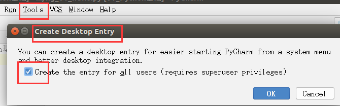
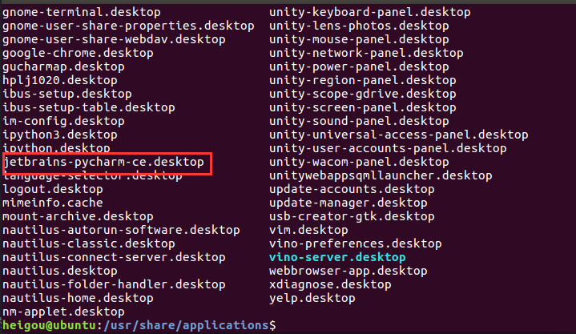

<!-- TOC depthFrom:1 depthTo:6 withLinks:1 updateOnSave:1 orderedList:0 -->

- [Pycharm初始设置](#pycharm初始设置)
	- [01 恢复PyCharm的初始设置](#01-恢复pycharm的初始设置)
	- [第一次启动PyCharm](#第一次启动pycharm)
	- [新建/打开一个Python项目](#新建打开一个python项目)
		- [项目简介](#项目简介)
		- [打开Python项目](#打开python项目)
	- [新建项目](#新建项目)
	- [设置PyCharm字体显示](#设置pycharm字体显示)
	- [PyCharm 的升级以及其他](#pycharm-的升级以及其他)
		- [安装和启动步骤](#安装和启动步骤)
		- [设置社区版启动图标](#设置社区版启动图标)
		- [卸载之前版本的PyCharm](#卸载之前版本的pycharm)

<!-- /TOC -->
# Pycharm初始设置
## 01 恢复PyCharm的初始设置
PyCharm的配置信息是保存在用户家目录下的.PyCharmxxxx.x目录下的， xxxx.x表示当前使用的PyCharm版本号

如果恢复PyCharm的初始设置，可以安装以下步骤：
+ 关闭正在运行的PyCharm
+ 在终端中执行以下命令，删除PyCharm的配置信息目录：
```
$ rm -r ~/.PyCharmxxxx.x
```
+ 重新启动PyCharm

##第一次启动PyCharm
略
## 新建/打开一个Python项目
### 项目简介
+ 开发项目就是开发一个专门解决一个复杂业务功能的软件
+ 通常每一个项目就具有一个独立专属的目录，用于保存所有和项目有关的文件
  + 一个项目通常包含很多源文件

### 打开Python项目
+ 直接点击Open按钮，然后浏览到之前保存Python文件的目录，既可以打开项目
+ 打开之后，会在目录下新建一个 .idea 目录，用于保存项目相关的信息，例如：解释器版本、项目包含的文件等等
+ 第一次打开项目，需要耐心等待 PyCharm对项目进行初始设置

**设置项目使用的解释器版本**

## 新建项目
**1）命名规则**
+ 以后项目名前面都以数字编号、随着知识点递增，编号递增
  + 例如 01_Python基础、02_分支、...
+ 每个项目下的文件名都以hg_xx_知识点方式来命名
  + 其中xx是演练文件的序号
+ 注意
  + 1.命名文件名时建议只使用小写字母、数字和下划线
  + 2.文件名不能以数字开始
+ 通过欢迎界面或者菜单File/New Project可以新建项目
**2）演练步骤**
+ 新建01_Python基础项目，使用Python，使用Python3.x解释器
+ 在项目下新建hg_01_hello.py Python文件
+ 编写 print("Hello") 代码

## 设置PyCharm字体显示


## PyCharm 的升级以及其他

### 安装和启动步骤

(1)解压缩文件，将解压后的文件保存在home目录下
```
$ tar -xvzf pycharm-community-2018.2.1.tar.gz -C ~
```
(2）启动PyCharm
```
$ cd pycharm-community-2018.2.1/bin
$ sh pycharm.sh &
```
(3)为了使得其他要用户也可以使用该解压缩后的文件，故将刚解压缩后的文件移动到根目录下的opt文件中
```
heigou@ubuntu:~$ sudo mv pycharm-community-2018.2.1/ /opt
[sudo] heigou 的密码：
heigou@ubuntu:~$ cd /opt
heigou@ubuntu:/opt$ ls
atom  google  pycharm-community-2018.2.1
```
### 设置社区版启动图标



### 卸载之前版本的PyCharm
1）程序安装
+ 1.程序文件目录
  + 将安装包解压缩
  + 所有相关文件都保存在解压缩的目录中
+ 2.配置文件目录
  + 启动PyCharm后，会在用户家目录下建立一个 .PyCharm的隐藏目录
  + 保存PyCharm相关配置信息
+ 3.快捷方式文件
  + cd /usr/share/applications/jetbrains-pycharm-ce.desktop



>Ubuntu中，应用程序启动的快捷方式通常保存在cd /usr/share/applications/目录下

2）程序卸载
**如果需要卸载PyCharm，那么把上述1、2、3对应的文件删掉即可**

+ 1.删除解压缩目录
```
$ sudo rm -r pycharm-community-2018.2.1\
```
+ 2.删除家目录下用于保存配置信息的隐藏目录
```
heigou@ubuntu:~$ sudo rm -r .PyCharmCE2018.2
```
> 如果不再使用PyCharm还需要将 /usr/share/applications/下的jetbrains-pycharm-ce.desktop删掉
