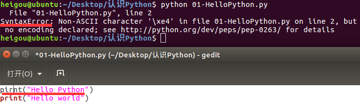

# 第一个Python程序

## 第一个HelloPython 程序
### Python源程序的基本概念
1.Python源程序就是一个特殊格式的文本文件，可以使用任意文本编辑软件做Python的开发
2.Python程序的文件扩张名通常都是 .py
### 演练步骤
+ 在桌面下，新建 认识Python 目录
```
heigou@ubuntu:~$ cd Desktop/
heigou@ubuntu:~/Desktop$ mkdir 认识Python
heigou@ubuntu:~/Desktop$ touch 01-HelloPython.py
```
+ 在 认识Python目录下新建 01-HelloPython.py文件
```
heigou@ubuntu:~/Desktop$ cd 认识Python/
heigou@ubuntu:~/Desktop/认识Python$ touch 01-HelloPython.py
```
+ 使用gedit编辑 01-HelloPython.py 并且输入以下内容：
```
print ("Hello Python")
print("Hello world")
```
+ 在终端中输入以下命令执行 01-HelloPython.py
```
heigou@ubuntu:~/Desktop/认识Python$ python 01-HelloPython.py
Hello Python
Hello world
```
> print 是Python中学习的第一个函数
> print函数的作用，可以把””内部的内容，输出到屏幕上

### 演练扩展——认识错误（BUG）
+ 编写的程序不能正常执行或者执行的结果不是我们期望的
+ 俗称BUG，是程序员在开发时非常常见的，初学者常见错误的原因包括：
1.手误


2.对已经学习过的知识理解还存在不足
3.对语言还需要学习和提升的内容
+ 在学习语言时，不仅要学会语言的语法，而且还要学会如何认识错误和解决错误的方法
> 每一个程序员都是在不断的修改错误中成长的

+ 将多条print写在一行



+ 缩进错误


> + python是一个格式非常严格额程序设计语言

+ Python2.x默认不支持中文
**目前市场上有两个Python的版本并存着，分别是Python2.x和Python3.x**
  + Python2.x默认不支持中文
  + Python2.x的解释器名称是python
  + Python3.x的解释器名称是python3

```
heigou@ubuntu:~/Desktop/认识Python$ python 01-HelloPython.py
  File "01-HelloPython.py", line 2
SyntaxError: Non-ASCII character '\xe4' in file 01-HelloPython.py on line 2, but no encoding declared; see http://python.org/dev/peps/pep-0263/ for details
heigou@ubuntu:~/Desktop/认识Python$ python3 01-HelloPython.py
Hello Python
你好世界
```
> + ASCII字符只包含256个字符，不支持中文

# Python 2.x与3.x版本简介

目前市场上有两个Python的版本并存着，分别是Python2.x和Python3.x
> 新的Python程序建议使用Python3.0版本的语法

+ Python2.x是过去的版本
  + Python2.x的解释器名称是python
+ Python3.x
  + Python3.x的解释器名称是python3
  + 相对于Python早期版本，这是一个较大的升级
  + 为了不带入过多的累赘，Python3.0在设计的时候没有考虑向下兼容
    + 许多早期Python版本设计的程序都无法在Python3.0上正常执行
  + Python3.0发布于2008年
+ 为了照顾现有的程序，官方提供了一个过度版本 -- Python2.6
  + 基本使用了Python2.x的语法和库
  + 同时考虑了向Python3.0的迁移，允许使用部分Python3.0的语法与函数
  + 2010年中推出的Python2.7被确定为最后一个Python2.x版本
> 提示：如果开发时，无法立即使用Python3.0，建议
> + 先使用Python3.0 版本进行开发
> + 然后使用Python2.6、Python2.7来执行，并且做一些兼容性的处理
