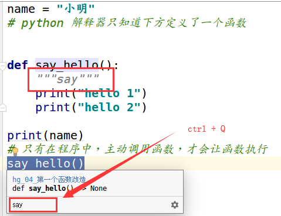
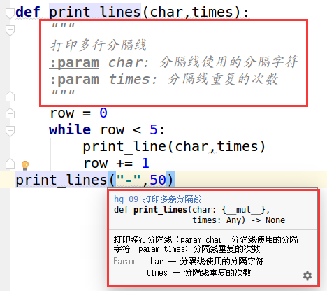

<!-- TOC depthFrom:1 depthTo:6 withLinks:1 updateOnSave:1 orderedList:0 -->

- [函数基础](#函数基础)
	- [函数的快速体验](#函数的快速体验)
		- [快速体验](#快速体验)
	- [函数的基本使用](#函数的基本使用)
		- [函数的定义](#函数的定义)
		- [函数的调用](#函数的调用)
		- [第一个函数改造](#第一个函数改造)
		- [PyCharm的调试工具](#pycharm的调试工具)
		- [函数文档注释](#函数文档注释)
	- [函数的参数](#函数的参数)
		- [函数参数的使用](#函数参数的使用)
		- [形参和实参](#形参和实参)
	- [函数的返回值](#函数的返回值)
	- [函数的嵌套调用](#函数的嵌套调用)
	- [使用模块中的函数](#使用模块中的函数)
		- [模块名也是一个标识符](#模块名也是一个标识符)
		- [pyc文件](#pyc文件)

<!-- /TOC -->
# 函数基础
## 函数的快速体验
### 快速体验
+ 所谓函数，就是把具有独立功能的代码块组织为一个小模块，需要的时候调用
+ 函数的使用包含两个步骤：
  - 定义函数 -- 封装独立的功能
  - 调用函数 -- 享受封装的成果
+ 函数的作用，在开发程序时，使用函数可以提高编写的效率以及代码的 **重用**

**演练步骤**
1.新建04_函数项目
2.复制之前完成的乘法表文件
3.修改文件，增加函数定义multiple_table()
```shell
def multiple_table():

    # 打印9行小星星
    row = 1
    while row <= 9:
        col = 1
        while col <= row:
            # print("*",end="")
            print("%d * %d = %d" %(col,row,col * row), end="\t")
            col += 1
        print("")  # 在一行输出完成之后，添加换行
        row += 1
```
4.新建另外一个文件，使用import导入并且调用函数
```shell
import hg_01_九九乘法表
hg_01_九九乘法表.multiple_table()
```
## 函数的基本使用
### 函数的定义
定义函数格式如下：
```shell
def 函数名()：
  函数封装的代码
  ......
```
+ def是英文define的缩写
+ 函数名称应该能够表达函数封装代码的功能，方便后续调用
+ 函数名称的命名应该符合标识符的命名规则
  - 可以由字母、下划线和数字组成
  - 不能以数字开头
  - 不能与关键字重名
```
### 函数的调用
通过 函数名() 即可完成对函数的调用：
```shell
def say_hello():
    print("hello 1")
say_hello()
```

### 第一个函数改造
```shell
  name = "小明"
  # python 解释器只知道下方定义了一个函数
  def say_hello():
      print("hello 1")
      print("hello 2")

  print(name)
  # 只有在程序中，主动调用函数，才会让函数执行
  say_hello()
  print(name)
```
**不能在定义函数之前就调用函数**
```shell
NameError: name 'say_hello' is not defined
```
### PyCharm的调试工具
+ F8 Step Over可以单步执行代码，会把函数调用看作是一行代码直接执行
+ F7 Step into可以单步执行代码，如果是函数，会进入函数内部
### 函数文档注释
+ 开发中，如果



## 函数的参数
```shell
def sum_2_sum():
    """对两个数字求和"""
    num1 = 10
    num2 = 20
    result = num1 + num2
    print("对两个数字求和结果：%d" % result)
sum_2_sum()
```
### 函数参数的使用
+ 在函数名的后面的小括号内部填写参数
+ 多个参数之间使用，分隔
```shell
def sum_2_sum(num1,num2):
    """对两个数字求和"""
    # num1 = 10
    # num2 = 20
    result = num1 + num2
    print("对两个数字求和结果：%d" % result)
sum_2_sum(10,30)
```

### 形参和实参
+ 形参：定义函数时，小括号中的参数，是用来接收参数用的，在函数内部作为变量使用
+ 实参：调用函数时，小括号中的参数，是用来把数据传递到函数内部用的

## 函数的返回值
+ 在程序开发中，希望一个函数执行结束后调用一个函数的执行结果
+ 返回值是函数完成工作后，最后给调用者的一个结果
+ 在函数中使用 return 关键字可以返回结果
+ 调用函数一方，可以使用变量来接收函数的返回结果
> return 表示返回，后续的代码都不会被执行

```shell
def sum_2_sum(num1,num2):
    """对两个数字求和"""
    # num1 = 10
    # num2 = 20
    result = num1 + num2
    return result
sum_result = sum_2_sum(10,30)
print("对两个数字求和结果：%d" % sum_result)
```
## 函数的嵌套调用
```shell
def test1():
    print("*" * 50)
def test2():

    print("-" * 50)
    test1()
    print("+" * 50)
test2()
```
```shell
def print_line(char,times):
    print(char * times)
print_line("+",10)
```
```shell
def print_line(char,times):
    print(char * times)

def print_lines(char,times):
    row = 0
    while row < 5:
        print_line(char,times)
        row += 1
print_lines("-",50)
```

+ 详细注释函数
+ 查看函数注释（ctrl+Q）



## 使用模块中的函数
+ 模块就好比是工具包，要想使用工具包中的工具，需要导入 import 这个模块
+ 每一个以扩展名py结尾的Python源代码文件都是一个模块
+ 在模块中定义的全局变量、函数都是模块能够提供给外界直接使用的工具

+ 分隔线模块

```shell
def print_line(char,times):
    print(char * times)

def print_lines(char,times):
    row = 0
    while row < 5:
        print_line(char,times)
        row += 1
print_lines("-",50)
```
+ 体验模块

```shell
import hg_10_分隔线模块

hg_10_分隔线模块.print_line("-",50)
hg_10_分隔线模块.print_lines("+",50)
```
### 模块名也是一个标识符
+ 标识符可以由字母、下划线和数字组成
+ 不能以数字开头
+ 不能与关键字重名
> 注意：如果在给Python文件起名时，以数字开头无法在PyCharm中导入这个模块

### pyc文件
> c 是compiled编译股的意思
