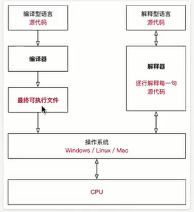

<!-- TOC depthFrom:1 depthTo:6 withLinks:1 updateOnSave:1 orderedList:0 -->

- [Python 简介](#python-简介)
	- [Python 起源](#python-起源)
	- [解释器](#解释器)
	- [Python的设计目标](#python的设计目标)
	- [Python的设计哲学](#python的设计哲学)
- [为什么选择Python](#为什么选择python)
- [Python特点](#python特点)
- [Python的优缺点](#python的优缺点)
	- [优点](#优点)
	- [缺点](#缺点)

<!-- /TOC -->
# Python 简介
## Python 起源
Python的创始人 吉多.范罗苏姆
## 解释器
+ 计算机不能直接理解任何机器语言以外的语言，所以必须要把程序员所写的程序语言翻译成机器语言，计算机才能执行程序。将其他语言翻译成机器语言的工具，被称为编译器
+ 编译器翻译的方式有两种：一个是编译，另外一个是解释。两种方式之间的区别在于翻译时间点的不同。当编译器以解释方式运行的时候，也称之为解释器

+ 编译型语言：程序在执行之前需要一个专门的编译过程，把程序编译成为机器语言的文件，运行是不需要重新翻译，直接使用编译的结果就行了。程序执行效率高，依赖编译器，跨平台性能差。如C、C++
+ 解释型语言：解释型语言编写程序不进行预先编译，以文本方式存储程序代码，会将代码一句一句直接运行。在发布程序时，看起来省了道编译工序，但是在运行程序的时候，必须先解释再运行

**编译型语言和解释型语言对比**

+ 速度 -- 编译型语言比解释型语言执行速度快
+ 跨品台性 -- 解释型语言比编译型语言跨品台性好

## Python的设计目标
+ 一门简单直观的语言并与主要竞争着一样强大
+ 开源，一边任何人都可以为他做贡献
+ 代码想纯英语那样容易理解
+ 适用于短期开发的日常任务

## Python的设计哲学

1.优雅
2.明确
3.简单

+ Python开发者的哲学是： **用一种方法，最好是只有一种方法来做一件事情**
+ 如果面临多种选择，Python开发者一般会拒绝复杂的语法，而选择明确没有或者很少有歧义的语法

> 在Python社区，吉多被称为“仁慈的独裁者”

# 为什么选择Python

+ 代码量少
> 同样的问题，用不同的语言解决，代码量差距还是很多的，一般情况下 Python 是 Java的1/5

# Python特点
+ Python是完全面向对象的语言
  + 函数、模块、数字、字符串都是对象，在Python中一切皆对象
  + 完全支持继承、重载、多重继承
  + 支持重载运算符，也支持泛型设计
+ Python拥有一个强大的标准库，Python语言的核心只包含 **数字、字符串、列表字典、文件** 等常见类型和函数，而由Python标准库提供了系统管理、网络通信、文本处理、数据库接口、图形系统、XML处理等额外功能
+ Python社区提供了大量的第三方模块，使用方式与标准库类似。它们的功能覆盖科学计算、人工智能、机器学习、Web开发、数据库接口、图形系统多个领域

**面向对象的思维方式**
+ 面向对象是一种思维方式，也是一门程序设计技术
+ 要解决一个问题前，首先考虑由谁来做，怎么做事情，是谁的职责，最后把事情做好就行
  + 对象 就是 **谁**
+ 要解决复杂的问题，就可以找多个不同的对象，各司其职，共同实现，最终完成需求

# Python的优缺点
## 优点
+ 简答、易学
+ 免费、开源
+ 面向对象
+ 丰富的库
+ 可扩展性
  + 如果需要一段关键代码运行得更快或者希望某些算法不公开，可以把这部分程序用C或C++编写，然后在Python程序中使用他们
+ 等等

## 缺点
+ 运行速度
+ 国内市场小
+ 中文资料缺乏
