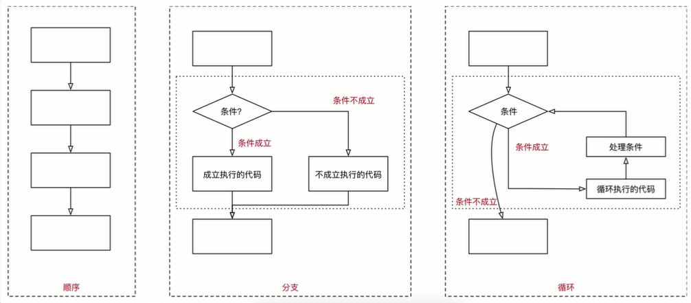
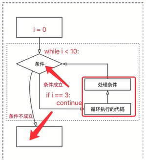

<!-- TOC depthFrom:1 depthTo:6 withLinks:1 updateOnSave:1 orderedList:0 -->

- [变量的命名](#变量的命名)
	- [标识符和关键字](#标识符和关键字)
	- [关键字](#关键字)
	- [变量的命名规则](#变量的命名规则)
- [判断（if）语句](#判断if语句)
	- [开发中的应用场景](#开发中的应用场景)
	- [if语句体验](#if语句体验)
		- [if 判断语句基本语法](#if-判断语句基本语法)
		- [判断年龄](#判断年龄)
		- [else处理条件不满足的情况](#else处理条件不满足的情况)
		- [判断语句演练 -- 判断年龄](#判断语句演练-判断年龄)
- [运算符](#运算符)
	- [比较（关系）运算符](#比较关系运算符)
	- [逻辑运算](#逻辑运算)
		- [and](#and)
		- [or](#or)
		- [not](#not)
	- [if 语句进阶](#if-语句进阶)
		- [elif](#elif)
		- [if的嵌套](#if的嵌套)
- [综合应用](#综合应用)
	- [石头剪刀布](#石头剪刀布)
	- [随机数处理](#随机数处理)
- [循环](#循环)
	- [程序的三大流程](#程序的三大流程)
	- [while 循环基本使用](#while-循环基本使用)
		- [while语句基本语法：](#while语句基本语法)
		- [赋值运算符](#赋值运算符)
		- [Python中的计数方法](#python中的计数方法)
		- [循环计算](#循环计算)
	- [break 和continue](#break-和continue)
	- [循环嵌套](#循环嵌套)
		- [循环嵌套](#循环嵌套)
		- [演练](#演练)

<!-- /TOC -->
<!-- TOC depthFrom:1 depthTo:6 withLinks:1 updateOnSave:1 orderedList:0 -->

- [变量的命名](#变量的命名)
	- [标识符和关键字](#标识符和关键字)
	- [关键字](#关键字)
	- [变量的命名规则](#变量的命名规则)
- [判断（if）语句](#判断if语句)
	- [开发中的应用场景](#开发中的应用场景)
	- [if语句体验](#if语句体验)
		- [if 判断语句基本语法](#if-判断语句基本语法)
		- [判断年龄](#判断年龄)
		- [else处理条件不满足的情况](#else处理条件不满足的情况)
		- [判断语句演练 -- 判断年龄](#判断语句演练-判断年龄)
- [运算符](#运算符)
	- [比较（关系）运算符](#比较关系运算符)
	- [逻辑运算](#逻辑运算)
		- [and](#and)
		- [or](#or)
		- [not](#not)
	- [if 语句进阶](#if-语句进阶)
		- [elif](#elif)
		- [if的嵌套](#if的嵌套)
- [综合应用](#综合应用)
	- [石头剪刀布](#石头剪刀布)
	- [随机数处理](#随机数处理)
- [循环](#循环)
	- [程序的三大流程](#程序的三大流程)
	- [while 循环基本使用](#while-循环基本使用)
		- [while语句基本语法：](#while语句基本语法)
		- [赋值运算符](#赋值运算符)
		- [Python中的计数方法](#python中的计数方法)
		- [循环计算](#循环计算)
	- [break 和continue](#break-和continue)
	- [循环嵌套](#循环嵌套)
		- [循环嵌套](#循环嵌套)
		- [演练](#演练)

<!-- /TOC -->
# 变量的命名
## 标识符和关键字
>标识符就是程序员定义的变量名、函数名
> 名字需要有见名知义的效果
+ 标识符可以由字母、下划线和数字数字组成
+ 不能以数字开头
+ 不能与关键字重名

## 关键字
+ 关键字就是在 Python内部已经使用的标识符
+ 关键字具有特殊意义和功能
+ 开发者不允许定义和关键字相同的关键字

通过以下命令可以查看 Python 中的关键字
```shell
In [1]: import keyword
In [2]: print(keyword.)
keyword.iskeyword  keyword.kwlist     keyword.main       
In [2]: print(keyword.kwlist)
['False', 'None', 'True', 'and', 'as', 'assert', 'break', 'class', 'continue', 'def', 'del', 'elif', 'else', 'except', 'finally', 'for', 'from', 'global', 'if', 'import', 'in', 'is', 'lambda', 'nonlocal', 'not', 'or', 'pass', 'raise', 'return', 'try', 'while', 'with', 'yield']
```
> + import **关键字** 可以导入一个“工具包”
> 在Python中不同的工具包，提供不同的工具

## 变量的命名规则
> **命名规则** 可以被视为一种惯例，并绝无对与强制
> 目的是为了增加代码的识别和可读性

+ 注意 Python中的标识符是区分大小写的

1. 在定义变量时，为了保证代码格式， = 的左右应该各保留一个空格
2. 在Python中，如果变量名需要有二个或多个单词组成，可以按照以下方式命名，
  a. 每个单词都使用小写字母
  b. 单词与单词之间使用 _ 下划线连接
  c. 例如：first_name、last_name

**驼峰命名法**
+ 当变量名是由二个或多个单词组成，还可以利用驼峰命名法来命名
+ 小驼峰命名
  + 第一个单词以小写字母开头，后续单词的首字母大写
  + 例如：firstName
+ 大驼峰命名法
  + 每一个单词的首字母都采用大写
  + 例如：firstName

# 判断（if）语句
## 开发中的应用场景
火车检票
**程序中的判断**


**判断的定义**
+ 如果条件满足，才能做某件事情
+ 如果条件不满足，就做另外一件事情，或者什么也不做
+ 判断语句又被称为“分支语句”

## if语句体验
### if 判断语句基本语法
在Python中，if语句就是用来进行判断的，格式如下：
```shell
if 要判断的条件：
    条件成立时，要做的事情：
    ......
```
> 注意：代码的缩进为一个tab键，或者4个空格 --  **建议使用空格**
> + 在Python开发中，Tab和空格不要混用

### 判断年龄
```shell
  # 1.定义一个整数变量记录年龄
  age = 14
  # 2.判断是否满足18岁
  if age >= 18:
      # 3. 如果满了18岁可以进入网吧
      print("已经成年")

  print("查看执行流程")
```
### else处理条件不满足的情况
**在不满足条件时，做其他事情**

**else,格式如下：**
```shell
if 要判断的条件：
    条件成立时，要做的事情：
    ......
else：
  条件不成立时，要做的事情
  ......
```
**条件是在if中判断的，if和else语句以及各自的缩进部分共同是一个完整的代码块，else必须配合if才能使用**

### 判断语句演练 -- 判断年龄
```shell
  # 输入用户年龄
  age = 18
  # 判断是否满18岁（>=）
  if age >= 18:
      # 如果满18岁，允许进网吧
      print("允许进网吧")
  else:
      # 如果未满18岁，提示不能进入
      print("不能进入")
```
**改进**
```shell
  # 输入用户年龄
  age = float(input("请输入年龄：")) # input通过控制台输入的内容是字符串形式,
                                  # 需要转换
  # 判断是否满18岁（>=）
  if age >= 18:
      # 如果满18岁，允许进网吧
      print("允许进网吧")
  else:
      # 如果未满18岁，提示不能进入
      print("不能进入")
```
# 运算符
[数学符号表链接](http://zh.wikipedia.org/wiki/数学符号表)
## 比较（关系）运算符
|运算符|描述|
|:----:|:---|
|==   |检查两个操作数的值是否相等，如果是，则条件成立，返回Ture   |
|!=   |检查两个操作数的值是否不相等，如果是，则条件成立，返回Ture   |
|>   |检查左操作数的值是否 **大于**右操作数，如果是，则条件成立，返回Ture   |
|<   |检查左操作数的值是否 **小于** 右操作数，如果是，则条件成立，返回Ture    |
|>=   |检查左操作数的值是否 **大于或等于** 右操作数，如果是，则条件成立，返回Ture   |
|<=   |检查左操作数的值是否 **小于或等于** 右操作数，如果是，则条件成立，返回Ture   |

> Python 2.x 中判断 **不等于** 还可以使用 <> 运算符
> != 在Python2.x中同样可以用来判断 **不等于**

## 逻辑运算
+ 在程序开发中，通常在判断条件时，需要同时判断多个条件
+ 只有多个条件都满足，才能够执行后续代码，这个时候需要使用到逻辑运算
+ 逻辑运算符可以把多个条件按照逻辑进行连接，变成更复杂的条件
+ Python中的逻辑运算符包括：与and/或or/非not三种

### and
条件1 和 条件2
+ 与/并且
+ 两个条件同时满足，就返回True
+ 只要有一个不满足，就返回False

### or
条件1 和 条件2
+ 或/或者
+ 两个条件只要有一个满足，就返回True
+ 只要两个条件都不满足，就返回False

### not
+ 非/不是

|条件|结果|
|:---|:---|
|成立   |不成立   |
|不成立   | 成立 |

**逻辑运算演练**
```shell
  # 1.定义一个整数变量age，编写代码判断年龄是否正确
  age = 130
  # 要求人的年龄在0-120之间
  if age >= 0 and age <= 120:
      print("年龄正确")
  else:
      print("年龄不正确")
```
```shell
  # 定义两个整数变量python_score、c_sore
  python_score = 80
  c_sore = 75
  # 要求只要有一门成绩 > 60 就算合格
  if python_score > 60 or c_sore > 60:
      print("考试通过")
  else:
      print("考试失败")
```

```shell
  # 定义一个布尔型变量is_employee,编写判断是否是本公司员工
  is_employee = False
  # 如果不是提示不允许入内
  # 在开发中，通常希望某个条件不满足时，执行一些代码，可以使用not
  # 如果需要拼接复杂的逻辑计算条件，同样也可能使用到not
  if not is_employee:
      print("非本公司人员，不得入内")
```
## if 语句进阶
### elif
+ 在开发中，使用if可以判断条件
+ 使用else可以处理条件不成立的情况
+ 但是，如果希望再增加一些条件，条件不同，需要执行的代码不同时，就可以使用elif
+ 语法格式如下：
```shell
if 条件1：
  条件1满足执行代码
  ...
elif 条件2：
  条件2满足执行代码
  ...
elif 条件3：
  条件3满足执行代码
  ...
else 条件4：
  条件4满足执行代码
  ...
```
**注意**
1.elif和else都必须和if联合使用，而不能单独使用
2.可以将if、elif和else以及各自缩进的代码，看成一个完整的代码块

**elif的演练**
```shell
  # 1.定义holiday_name 字符串变量记录节日名称
  holiday_name = "情人节"
  # 如果是情人节 应该买玫瑰/看电影
  if holiday_name == "情人节":
      print("买玫瑰")
      print("看电影")
  # 如果是平安夜应该买苹果/吃大餐
  elif holiday_name == "平安夜":
      print("买苹果")
      print("吃大餐")
  # 如果是生日 应该买蛋糕
  elif holiday_name == "生日":
      print("买蛋糕")
  # 其他每天都是节日
  else:
      print("其他每天都是节日")
```
### if的嵌套
> elif 的应用场景：同时判断多个条件，所有条件都是 **平级** 的
+ 在开发中，使用if进行条件判断，如果希望在条件成立的执行语句中再增加条件判断，就可以使用if的嵌套
+ if 的嵌套 应用场景：在之前的条件满足的前提下，再增加额外的判断
+ if 的嵌套 的语法格式，除了缩进之外和之前没区别
+ 语法格式如下：
```shell
  if 条件1：
    # 条件1满足执行代码
    ...
    if 条件2：
      条件2满足执行代码
      ...
    # 条件2不满足的处理  
    else：
      条件2满足执行代码
      ...
  # 条件1不满足的处理
  else 条件4：
    条件1不满足时，执行的代码
    ...
```

**if的嵌套演练 -- 火车站安检**
```shell
  # 1.定义一个布尔型变量 has_ticket 表示是否有车票
  has_ticket = True
  #定义整型变量knife_length 表示刀的长度，单位：厘米
  knife_length = 30
  # 首先检查是否有车票如果有，才允许进行安检
  if has_ticket:
      print("车票检查通过，可安检")
      # 安检时，需要检查刀的长度，判断是否超过20厘米
      if knife_length > 20:
      # 如果超过20厘米，提示刀的长度，不允许上车
          print("刀长，有%d厘米" %knife_length)
          print("不能上车")
      # 如果不超过20厘米，安检通过
      else:
          print("旅途愉快")
  # 如果没有车票，不允许进门
  else:
      print("请买票")
```
> tab键可以向右tab，shift+tab可以向左回退

# 综合应用
## 石头剪刀布
```shell
	# 从控制台输入拳 ——石头（1）/剪刀（2）/布（3）
	player = int(input("请输入出拳 石头（1）/剪刀（2）/布（3）:"))
	# 电脑随机出拳——先假定电脑只会出石头（1）
	computer = 1
	print("玩家选择拳头%d-电脑出拳%d" % (player,computer))
	# 比较胜负
	# 1 石头 胜 剪刀
	# 2 剪刀 胜 布
	# 3 布 胜 石头
	# if (()
	# or ()
	# or ()): ——调整代码格式，方便阅读
	if ((player == 1 and computer == 2)
	        or(player == 2 and computer == 3)
	        or(player == 3 and computer ==1)):

	    print("人类完爆了")
	# 平局
	elif player == computer:
	    print("平局")
	# 其他的情况都是电脑获胜
	else:
	    print("电脑获胜")
```
## 随机数处理
+ 在Python中，要使用随机数，首先需要导入随机数的模块 ———— “工具包”
```shell
import random
```
+ 导入模块后，可以直接在模块名称后面敲一个 . 然后按Tab键，会提示该模块中包含的所有函数
+ random.randint(a,b),返回[a,b]之间的整数，包含a和b
```shell
In [1]: import random
In [2]: random.randint(1,10)
Out[2]: 1
In [3]: type(random.randint(1,10))
Out[3]: int
```
```shell
	# 导入随机工具包
	# 注意：在导入工具包时，应该将导入的语句放在文件的顶部
	# 方便下方代码使用
	import random
	computer = random.randint(1,3)
```
# 循环
## 程序的三大流程
+ 在程序开发中，一共有三种流程方式：
	- 顺序 -- 从上向下，顺序执行代码
	- 分支 -- 根据条件判断，决定执行代码的分支
	- 循环 -- 让特定代码重复执行



## while 循环基本使用
+ 循环的作用是让特定代码重复执行
+ while循环最常用场景是让执行的代码安装指定次数重复进行
### while语句基本语法：
```shell
初始条件设置 —— 通常是重复执行的计数器
while 条件（判断计数器 是否达到目标次数）：
	条件满足时，做事情1
	条件满足时，做事情2
	条件满足时，做事情3
	......
	处理条件（计数器 + 1）
```
**注意**
+ while 语句以及缩进部分是一个完整的代码

**循环演练**
```shell
	# 打印5遍HelloPython
	# 1. 定义一个整数变量，记录循环次数
	i= 1
	# 2.开始循环
	while i <= 5:
	    # 1>希望在循环内执行的代码
	    print("HelloPython")
	    # 2> 处理计数器
	    i = i + 1
```
> 循环结束之后，之前定义的计数器条件的数值是依旧存在的

**死循环**

### 赋值运算符
+ 在Python中，使用 = 可以给变量赋值
+ 在算术运算时，为了简化代码的编写，Python提供了一系列的与算术运算符对应的赋值运算符
+ **注意：赋值运算符中间不能使用空格**

|运算符 |描述 |实例 |
|:---|:---|:---|
| =  | 简单的赋值运算  | c = a + b 将 a + b 的运算结果赋值为c |
| +=  |加法赋值运算符  |c += a 等效于  c = c + a|
|-=   |减法赋值运算符   |c -= a 等效于  c = c - a|
|*=   |乘法赋值运算符   |c ×= a 等效于  c = c × a   |
|/=    |除法赋值运算符   |c /= a 等效于  c = c /a   |
|//=   |取整赋值运算符  |c //= a 等效于  c = c // a   |
|%=   | 取模（余）赋值运算符  |c %= a 等效于  c = c % a    |
|**=   | 幂值运算符  |c ** =a等效于c=c ** a   |

### Python中的计数方法
常见的计数方法有两种：
+ 自然计数法（从1开始）-- 符合人类的习惯
+ 程序计数法（从0开始）

### 循环计算
> 在程序开发中，通常会遇到利用循环重复计算的需求
**求解方法**
1. 在while上方定义一个变量，用于存放最终统计的计算结果
2. 在循环体内部，每次都用最新的计算结果，更新之前定义的变量

**计算0~100之间所有数字的累计求和结果**
```shell
	# 计算0~100之间所有数字的累计求和结果
	# 0. 定义最终结果变量
	result = 0
	# 1.定义一个整数的变量记录循环的次数
	i = 0
	# 2. 开始循环
	while i <= 100:
	    print(i)
	    # 每一次循环，result变量和i计数器相加
	    result += i
	    # 处理计数器
	    i += 1
	print("0~100之间所有数字的累计求和结果:%d" %result)
```
**需求进阶**
+ 计算计算0~100之间所有偶数的累计求和结果步骤
+ 1.编写循环 确认要计算的数字
+ 2.添加结果变量，在循环内部处理计算结果
```shell
	i = 0
	# 1> 定义一个记录结果的变量
	result = 0
	while i <= 100:
	    #判断变量i中的数值，是否是一个偶数
	    # 偶数 i % 2 == 0
			# 奇数 i % 2 != 0
	    if i % 2 == 0:
	        print(i)
	        result += i
	    # 处理计数器
	    i += 1
	print("0~100之间所有偶数的累计求和结果:%d" %result)
```

## break 和continue
> break 和 continue专门在循环中使用的关键字

+ break 某一条件满足时，退出循环，不再执行后续重复的代
```shell
i = 0
while i < 10:
    # break 某一条件满足时，退出循环，不再执行后续重复的代码
    # i == 3
    if i == 3:
        break
    print(i)
    i += 1
print("over")
```
+ continue 某一条件满足时，不再执行后续重复的代码



```shell
i = 0
while i < 10:
    # continue 某一条件满足时，不再执行后续重复的代码
    # i == 3
    if i == 3:
        # 注意：在循环中，如果使用continue这个关键字
        # 在使用关键字之前，需要确认循环计数是否修改
        #否则会导致死循环
        i += 1
        continue
    print(i)
    i += 1
```
> break 和 continue只是针对当前所在循环有效

## 循环嵌套
### 循环嵌套
+ while 嵌套：
```shell
while 条件1：
    条件满足时，做事情1
		条件满足时，做事情2
		......
		while 条件2：
		    条件满足时，做事情1
				条件满足时，做事情2
				......
				处理条件2
		处理条件1
```
### 演练

** 在控制台连续输出5行 *,每一行星号数量以此递增**
```shell
	# 1.定义一个计数器变量，从1开始
	row = 1
	while row <=5 :
	    print("*" * row)
	    row += 1
```
**prin函数扩展**
+ 在默认情况下，print函数输出内容之后，会自动在内容末尾增加换行
+ 如果不希望末尾增加换行，可以在print函数输出内容后面增加，end =""
+ 其中 “” 中间可以指定print 函数输出之后，希望继续显示的内容
```shell
	# 在默认情况下，print函数输出内容之后，会自动在内容末尾增加换行
	# print("*",end="")
	print("*",end="---")
	print("*")
	# 结果：**
	结果：*---*
```

**打印小星星while嵌套方式**
```shell
	# 在控制台连续输出5行 *,每一行星号数量以此递增
	# *
	# **
	# ***
	# ****
	# *****
	# 1> 完成 5 行内容的简单输出
	# 2> 分析每行内部的 × 应该如何处理
row = 1
while row <= 5:
    # 每一行要打印的星星是和当前的行数一样的
    # 增加一个小的循环，专门负责当前行中，每一 ‘列‘ 的星星显示
    # 1. 定义一个列计数器变量
    col = 1
    # 2. 开始循环
    """
    1 1
    2 2
    3 3
    4 4
    5 5
    """
    while col <= row:
        print("*",end="")
        # print("%d" %col)
        col += 1
    # print("第 %d 行" % row)
    print("")  # 在一行输出完成之后，添加换行
    row += 1
```
**九九乘法表**
1.打印9行小星星
2.将每一个*替换成对应的行与列相乘
```shell
	# 打印9行小星星
	row = 1
	while row <= 9:
	    col = 1
	    while col <= row:
	        # print("*",end="")
	        print("%d * %d = %d" %(col,row,col * row), end="\t") # 横向制表符
	        col += 1
	    print("")  # 在一行输出完成之后，添加换行
	    row += 1
```
**字符串的转义字符**
+ \t 在控制台输出一个制表符，协助在输出文本时垂直方向 保持对齐
```shell
print("小\t话")
print("小明\t笑话")
```
+ \n 在控制台输出一个换行符

> 制表符的功能是在不使用表格的情况下在垂直方向按列对其文本

|转义字符|描述|
|:---|:---|
|\\   |反斜杠符号   |
|\'   |单引号   |
|\“   |双引号   |
|\n   |换行   |
|\t   |横向制表符   |
|\r   |回车   |
